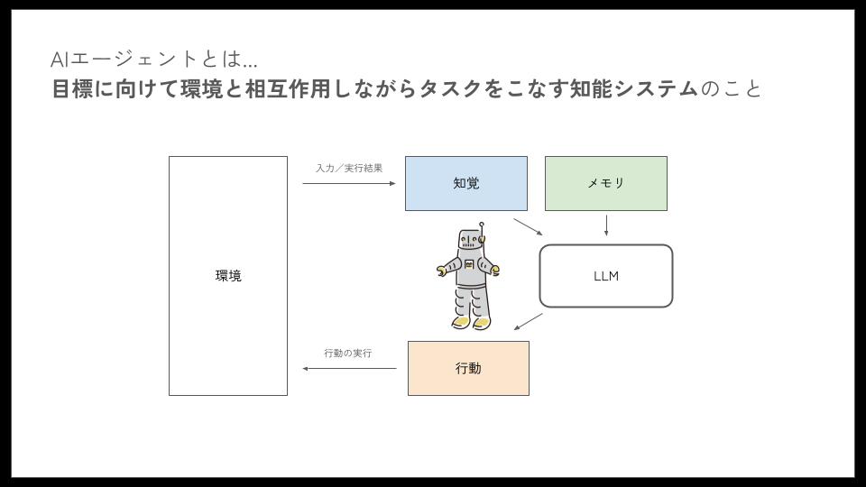
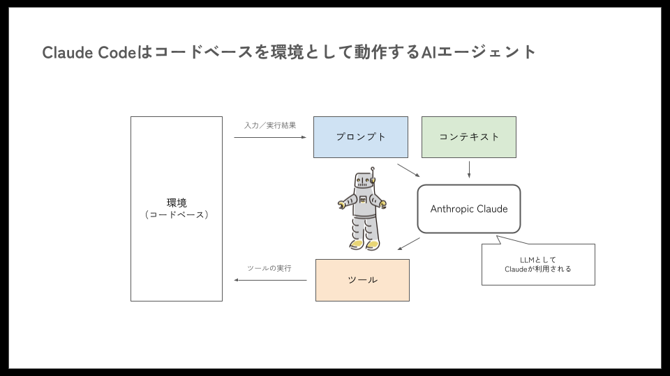
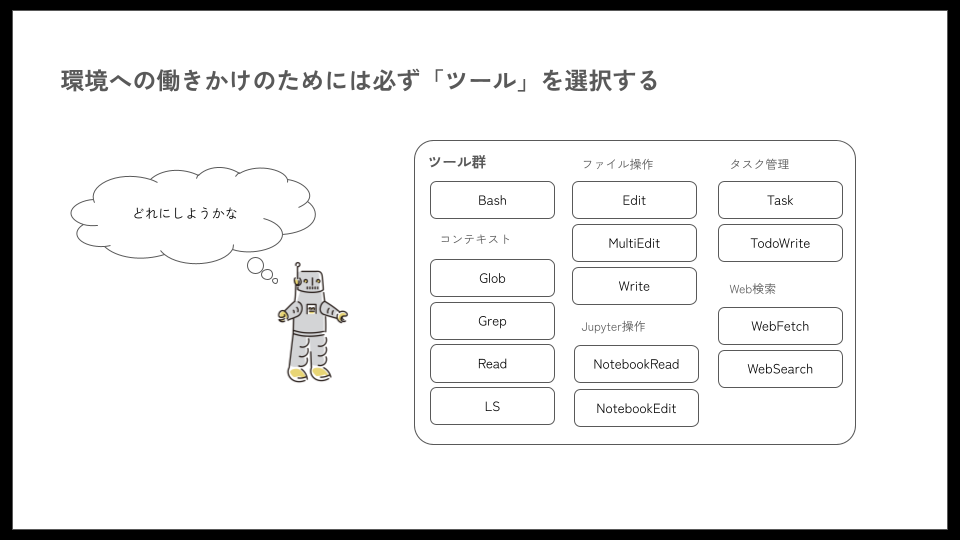
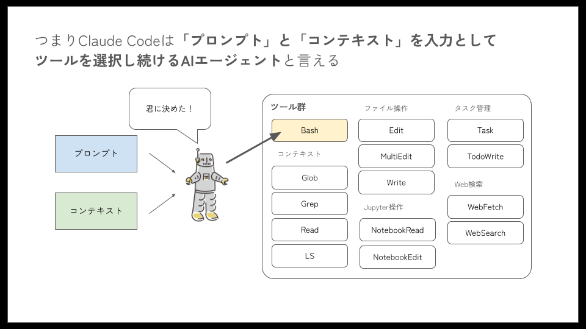

# Claude Code とは

この章では Claude Code について、AI エージェントとしての仕組みから理解できるよう、ステップバイステップで解説します。

本ドキュメントで記載しているトピックの詳細については、各トピック毎にリンクを掲載しています。

## 1. AI エージェントとしての Claude Code

### AI エージェントとは

[Claude Code](https://docs.anthropic.com/ja/docs/claude-code/overview)は、Anthropic 社が提供する、ソフトウェア開発タスクを支援するための AI エージェントです。開発者が指示した内容を理解し、コードベースを自律的に編集したり、自動テストを実行した結果を自身で分析し適切な改修を実施したり、といった行動を取ることができます。

2025 年 9 月現在では、Anthropic 社が提供する Claude Code 以外にも、OpenAI 社が提供する Codex や、Google 社が提供する Gemini CLI など、多くの AI エージェントがソフトウェア開発者に活用されています。

このように既に活用されている AI エージェントですが、そもそも AI エージェントとはどのような仕組みを指す言葉なのでしょうか。

[Artificial Intelligence: A Modern Approach](<https://github.com/yanshengjia/ml-road/blob/master/resources/Artificial%20Intelligence%20-%20A%20Modern%20Approach%20(3rd%20Edition).pdf>)による定義では、「エージェントとは、環境を認識し、目標を達成するために自律的に行動する存在」とされています。ここで言う環境とは、AI エージェントが働きかける場所のことを指します。例えば、ファイルシステムやインターネットのようなデジタル空間や、車の中といった物理空間を指します。

Claude Code のようなコーディングエージェントを考える場合、物理空間は含めません。また、単に環境を認識するだけで良いのではなく、環境を認識した上で、環境自体にも作用を加える（ファイルなどに変更を加える）機能も必要です。

そのため、ここでは AI エージェントを **「目標に向けて環境と相互作用しながらタスクをこなす知能システムのこと」** とします。

この定義は、本ドキュメントを執筆しているメンバーも執筆に関わっている[現場で活用するための AI エージェント実践入門](https://amzn.asia/d/3m7n97z)でも採用した定義です。

図では「行動」によって環境に働きかけた結果や、ユーザーからの入力を「知覚」として受け付けます。そして、AI エージェントが保持している「メモリ」と「知覚」を「LLM」に入力し、その結果「行動」が出力として得られます。この「行動」を「環境」に適用し、また得られた結果が「知覚」として受け付けられることになります。

（このようなループを「エージェントループ」と呼ぶことがあります）

### Claude Code の AI エージェントとしての位置付け

この定義を踏まえると、Claude Code は **「コードベースを環境として動作する AI エージェント」** と整理することができます。

Claude Code では「環境」からの入力は「プロンプト」として受け付けられます。これまでのユーザーからの入力やツールの実行結果は「コンテキスト」として保持され、「プロンプト」と「コンテキスト」は LLM（Anthropic Claude）に入力されます。LLM は次に実行する「ツール」を推論し、出力します。最後に、ツールを実行することで、環境に作用を及ぼします。

このように、環境から情報を受け取り、推論を経て環境に作用するエージェントループを繰り返すのが、Claude Code の基本的な仕組みです。

## 2. 環境に働きかけるための「ツール」

### Claude Code はツールを選択し続ける AI

先ほどの Claude Code のエージェントループ図では、環境への働きかけには必ず「ツール」を経由していました。

Claude Code では下図のように、ベースツールとしてデフォルトで選択できるツールが提供されています。ユーザーからの指示を達成するために、この中のいずれかのツールを選択する行動を取ります。

つまり、Claude Code は「プロンプト」と「コンテキスト」を入力として、ツールを選択し続ける AI エージェントなのです。

### Claude Code で利用できるツール一覧

各ツールでできることは次の表の通りです。デフォルトでは、Claude Code はこれらのツールを選択しながらタスクを遂行していきます。

| ツール名     | 説明                                               |
| ------------ | -------------------------------------------------- |
| Bash         | 環境でシェルコマンドを実行                         |
| Edit         | 特定のファイルに対象を絞った編集を行う             |
| Glob         | パターンマッチングに基づいてファイルを検索         |
| Grep         | ファイル内容のパターンを検索                       |
| LS           | ファイルとディレクトリを一覧表示                   |
| MultiEdit    | 単一ファイルに対して複数の編集をアトミックに実行   |
| NotebookEdit | Jupyter ノートブックセルを変更                     |
| NotebookRead | Jupyter ノートブックの内容を読み取り表示           |
| Read         | ファイルの内容を読み取り                           |
| Task         | 複雑な多段階タスクを処理するサブエージェントを実行 |
| TodoWrite    | 構造化されたタスクリストを作成・管理               |
| WebFetch     | 指定された URL からコンテンツを取得                |
| WebSearch    | ドメインフィルタリング付きで Web 検索を実行        |
| Write        | ファイルを作成または上書き                         |

### ツールを拡張するための「MCP」

MCP(Model Context Protocol)は、エージェントが利用できるツールを拡張するためのプロトコルです。Claude Code では、MCP を利用して、選択できるツールを拡張することができます。

[Context7](https://github.com/upstash/context7)や[Playwright](https://github.com/microsoft/playwright-mcp)のように配布されているものもありますが、[FastMCP](https://github.com/jlowin/fastmcp)といった仕組みを使えば自身で開発することも可能です。

例えば開発標準のドキュメントなどを Claude Code に読ませようとした場合、いちいち`Read`ツールで 1 件ずつ読ませていたのでは、効率が悪いことがあります。その場合、関連するドキュメントを検索して参照する MCP を独自開発すれば、Claude Code の実行ステップを減らすことができます。

**Claude Code は実行ステップが多くなればなるほど、ステップの記録にコンテキストを消費してしまうため、指示追従性が悪くなる傾向があります。** 実行効率の分析の際には、Claude Code の実行ログを、コンテキストサイズの大きい LLM に分析してもらうと、短時間で良い分析を得ることができます。筆者らのプロジェクトでは、ログ分析の際、入力に 1M トークン利用できる **Gemini 2.5 Pro** を活用しています。

:::info
MCP(Model Context Protocol)の詳細な解説は以下のドキュメントを参照してください。

- [MCP](../03_features/02_mcp.md)
  :::

## 3. ツール実行をプログラマブルに制御する「フック」

コード生成タスクでは、既に環境に整備されているデータベーススキーマを、Claude Code が変更しないよう制御したいシーンがあります。

このような場合、`CLAUDE.md`などに禁止事項として明記する手段も有効ですが、最終的に判断するのは LLM 次第なので、必ず守られるとは限りません。

そこで利用するのが「フック」です。フックを利用することで、任意のタイミングにおいてルールベースで Claude Code の行動を制御することができます。

例えば PreToolUse フックでは、Claude Code のツール選択内容を引数にとり、スクリプトで正規表現などを利用して、ツール利用の許可や拒否を自動的に実行することができます。先の例で言えば、`.sql`形式のファイルを作らせないことにより、データベーススキーマの変更を強制的に禁止させたりすることができます。

フックには次のタイプがあります。これらのフックを使い分けながら、ルールベースで Claude Code を制御します。

| フックタイプ     | 説明                                                                           |
| ---------------- | ------------------------------------------------------------------------------ |
| PreToolUse       | ツール呼び出しの前に実行（ブロック可能）                                       |
| PostToolUse      | ツール呼び出し完了後に実行                                                     |
| UserPromptSubmit | ユーザーがプロンプトを送信したときに、Claude が処理する前に実行                |
| Notification     | Claude Code が通知を送信するときに実行                                         |
| Stop             | Claude Code が応答を終了するときに実行                                         |
| SubagentStop     | サブエージェントタスクが完了するときに実行                                     |
| PreCompact       | Claude Code がコンパクト操作を実行しようとする前に実行                         |
| SessionStart     | Claude Code が新しいセッションを開始するか既存のセッションを再開するときに実行 |
| SessionEnd       | Claude Code セッションが終了するときに実行                                     |

比較的よく使われるフックは、`PreToolUse`、`Notification`、`Stop`です。

`PreToolUse`は、ツールの呼び出し前に、不正な行動をしないか事前チェックするために使用されます。これは先ほど`.sql`ファイルの作成を抑制する例でご紹介しました。

`Notification`、`Stop`は Claude Code の動作が終了したときに呼び出されるので、ユーザー（自分自身）に通知を送る際に利用されることが多いです。OS の通知で Claude Code の作業が終わったことを知らせたり、もし音声を再生できる仕組みがあるのであれば、音声で作業の完了などの情報を通知すると、複数ウィンドウで Claude Code を利用している場合に便利です。

:::info
フックの詳細な解説は以下のドキュメントを参照してください。

- [フック](../03_features/05_hooks.md)
  :::

## 4. 詳細なプロンプトを入力しやすくする「スラッシュコマンド」

Claude Code にまとまった作業をさせる場合は、可能な限り詳細な手順を Claude Code に伝える必要があります。しかし、毎回大量のプロンプトを入力することは現実的ではありません。また、実際の開発では、まず実装のプランニングを行って欲しい、ある資料を参照しながらトラブルシューティングを行って欲しい、といった Claude Code への依頼は、ある程度パターン化することができます。

このようなパターン化した依頼に対して、Claude Code では「スラッシュコマンド（カスタムコマンド）」として事前定義することができます。特に、作業 A をやったあとに作業 B を行い、必要があれば作業 C を行う、といったワークフロー型の作業を実施させる場合に便利です。

このようなパターン化したフロー（コマンド）は、チームで共有するようにすると、チームの生産性を向上させることができます。

ただ、ゼロからコマンドを整備していくのは大変なので、既に公開されている既存のコマンド集を参考にすることが近道です。日本の事例では、クラスメソッド社が公開している[Tsumiki](https://github.com/classmethod/tsumiki/tree/main)というフレームワークがあります。TDD ベースで開発を進められるようにコマンドが用意されています。

また、海外で人気なのが[SuperClaude](https://github.com/SuperClaude-Org/SuperClaude_Framework)というフレームワークです。こちらはコマンドもさることながら、後述するサブエージェント機能も駆使したつくりになっており、Claude Code を発展的に利用していくために参考になります。

:::info
スラッシュコマンド（カスタムコマンド）の詳細な解説は以下のドキュメントを参照してください。

- [カスタムコマンド化](../03_features/04_custom-commands.md)
  :::

## 5. プロンプトやツール実行履歴を保持する「コンテキスト」

ここまで「コンテキスト」という言葉が複数回登場してきました。「コンテキスト」とは、Claude Code が保持する「記憶（メモリ）」を意味すると考えてください。

公式にどの程度の容量がコンテキストの容量として確保されているかは明言されていませんが、Claude Code が保持できるコンテキストの容量には限りがあります。

コンテキストは CLAUDE.md をロードしたり、ファイルを Read したり、Web から情報を WebFetch したり、Bash によるコマンド実行を行ったり、これまで行ってきたあらゆる動作の記録を行うために消費されます。Claude Code は、このコンテキストを参照することで、これまで自身が何をしてきたのかを把握するのです。

ところで、先ほどコンテキストの容量には限りがあると言いました。コンテキストの保存量が一定のしきい値を超えると、Claude Code ではコンテキストの自動圧縮（auto-compaction）が実行されます。

可能な限り、これまでの経緯が失われないように圧縮されますが、やはりある程度のデータが消えてしまうことは否めません。そのため、いたずらに自動圧縮を繰り返させることは得策ではありません。このようなケースで、上手くコンテキストを扱うためには、次節で紹介する「サブエージェント」を活用します。

参考：入力トークン量によって LLM の性能が変化する現象は「Context Rot」として知られています。LLM はモデルによって入力上限が設定されていますが、実際にパフォーマンスを発揮するのは入力上限トークンよりも、もっと小さいトークンを入力した場合に限ります。Claude Code におけるコンテキスト上限も、Context Rot を意識したものになっていると推測されるため、Claude モデルの上限トークンより低く設定されているのではないかと推測しています。

- [Context Rot / Chroma Technical Report 2025.7.14](https://research.trychroma.com/context-rot)

:::info
コンテキストエンジニアリングの詳細な解説は以下のドキュメントを参照してください。

- [コンテキストエンジニアリング](../04_practical/02_context-engineering.md)
  :::

## 6. コンテキストエンジニアリングのための「サブエージェント」

エージェントは様々なファイルを参照しながらタスクを実行していきますが、単一のエージェントでは保持できるコンテキスト量に限界があります。この限界を乗り越えるための仕組みが「サブエージェント」です。

サブエージェントとは、親エージェント（`claude`コマンドで呼び出されているエージェント）が、他エージェント（サブエージェント）に処理を委譲する仕組みのことです。Claude Code では親エージェントがサブエージェントに「プロンプト」を入力することで、サブエージェントにエージェンティックな処理を実行させることができます。

サブエージェントがなぜコンテキストエンジニアリングに使えるのかと言うと、エージェントの持つコンテキストは、親エージェント、サブエージェントそれぞれ個別に保有することができるためです。

例えば Java のテスト実行時には大量のログが流れます。親エージェントが実行すると、コンテキストがテストログに食い潰されてしまうため、このようなときはサブエージェントを利用すると、親エージェントのコンテキストが汚染されずに済みます。大量にファイルを読み込んだり、試験実行時に大量のログが流れたりするような場合、サブエージェントに分割すると、上手くコンテキストをマネジメントすることができます。

一点注意したいのが、親エージェントとサブエージェントとは **相互にコンテキストを共有できない** 、ということです。例えばサブエージェントにコード実装をやらせようとすると、親エージェントが持っているコンテキストを継承できないため、コンテキストを踏まえた実装を実施させることができません。

この制約を踏まえると、サブエージェントに実タスクを実行させることは得策ではありません（上手くタスクを遂行できません）。既に生成された成果物をチェックさせたり、様々なファイルを読み込んだ上で適切な方策を親エージェントに連携するような、計画タスクを中心に担当させるのが良いでしょう。

また、サブエージェントでたくさんの作業をさせたとしても、親エージェントに返ってくるのは端的なメッセージのみなので、例えば「設計書レビュー結果」だったり、「障害調査結果」といったレポートを作業ログとして生成させるようにし、その情報をエージェントが相互に参照できるように設計すると、エージェント同士のコラボレーションをワークさせることができます。

:::info
サブエージェントの詳細な解説は以下のドキュメントを参照してください。

- [サブエージェント](../03_features/03_subagents.md)
  :::
