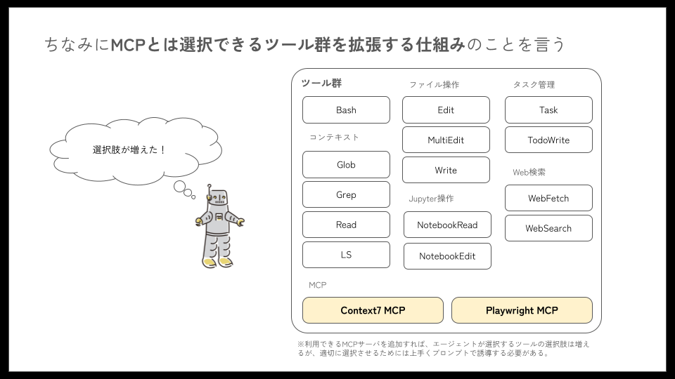

# MCP

## 概要

Claude Code の外部ツール連携機能は、Model Context Protocol (MCP) を通じて、Git、テストツール、CI/CD パイプラインなどの外部ツールとシームレスに統合します。これにより、既存の開発ワークフローを中断することなく、AI 支援開発を実現できます。



## Model Context Protocol (MCP) について

MCP (Model Context Protocol) とは、AI アプリケーションを外部システムに接続するためのプロトコルの一種です。
MCP を使用すると、AI アプリケーションは、データソース (ローカル ファイル、データベースなど)、ツール (検索エンジン、計算機など)、ワークフロー (専用のプロンプトなど) に接続して、重要な情報にアクセスし、タスクを実行できるようになります。

Claude Code では、このプロトコルを使用して様々な開発ツールと接続してタスクが実行できます。

### MCP の利点

- **標準プロトコル**: 統一されたインターフェースで複数のツールと連携
- **セキュリティ**: 安全な認証と権限管理
- **拡張性**: 新しいツールを簡単に追加可能
- **効率性**: 最適化された通信プロトコル

### MCP アーキテクチャと外部システム

```txt
┌───────────────┐
│    MCPホスト   │
│┌─────────────┐│
││MCPクライアント││
│└─────────────┘│
└───────────────┘
        ↓ MCP(JSON-RPC)
┌───────────────┐
│  MCPサーバー   │
└───────────────┘
        ↓　各ツール固有の接続方法
┌───────────────┐
│  外部システム   │
└───────────────┘
```

- **MCP ホスト**: 1 つまたは複数の MCP クライアントを調整および管理する AI アプリケーション
  - ここでは Claude Code が MCP ホスト
- **MCP クライアント**: MCP サーバーへの接続を維持し、MCP ホストが使用するために MCP サーバーからコンテキストを取得するコンポーネント
  - ここでは Claude Code の MCP 接続機能
- **MCP サーバー**: 各種外部ツールへのアダプターとして機能し、JSON-RPC プロトコルで通信
  - ローカル MCP サーバーの場合、ここも Claude Code が担当
  - リモート MCP サーバーの場合は外部のクラウドサービスが提供
- **外部システム**: Git、データベース、各種 API などの実際のツール・サービス
- **通信プロトコル**: ホストとサーバー間は JSON-RPC、サーバーと外部システム間は各ツール固有のプロトコル

### MCP でできること

MCP サーバーが接続されると、Claude Code に以下のようなことを依頼できます。

- **課題トラッカーから機能を実装する**: “JIRA 課題 ENG-4521 で説明されている機能を追加し、GitHub で PR を作成してください。”
- **監視データを分析する**: “Sentry と Statsig をチェックして、ENG-4521 で説明されている機能の使用状況を確認してください。”
- **データベースをクエリする**: “Postgres データベースに基づいて、機能 ENG-4521 を使用したランダムな 10 人のユーザーのメールアドレスを見つけてください。”
- **デザインを統合する**: “Slack に投稿された新しい Figma デザインに基づいて、標準のメールテンプレートを更新してください”
- **ワークフローを自動化する**: “新機能についてのフィードバックセッションにこれらの 10 人のユーザーを招待する Gmail の下書きを作成してください。“

## MCP サーバーの設定

ファイルシステム操作などの MCP サーバーは Claude Code が MCP サーバーを起動する「ローカル MCP サーバー」として、クラウドサービスが接続を提供している MCP サーバーは「リモート MCP への接続」として MCP サーバーを設定します。

その際、ローカル間は stdio のトランスポート方式で、リモート MCP サーバーとの間は SSE 方式か Streamable HTTP 方式での接続になります。将来的には Streamable HTTP 形式がより普及してくるものと想定しています。

### ローカル MCP サーバーの設定追加

```bash
# 基本構文
claude mcp add <name> <command> [args...]

# 実際の例: Airtableサーバーを追加
claude mcp add airtable --env AIRTABLE_API_KEY=YOUR_KEY \
  -- npx -y airtable-mcp-server
```

### リモート MCP サーバーへの接続設定

#### SSE（Server-Sent Events）サーバーの場合

```bash
# 基本構文
claude mcp add --transport sse <name> <url>

# 実際の例: Linearに接続
claude mcp add --transport sse linear https://mcp.linear.app/sse

# 認証ヘッダー付きの例
claude mcp add --transport sse private-api https://api.company.com/mcp \
  --header "X-API-Key: your-key-here"
```

#### Streamable HTTP サーバーの場合

```bash
# 基本構文
claude mcp add --transport http <name> <url>

# 実際の例: Notionに接続
claude mcp add --transport http notion https://mcp.notion.com/mcp

# Bearerトークン付きの例
claude mcp add --transport http secure-api https://api.example.com/mcp \
  --header "Authorization: Bearer your-token"
```

#### その他サーバーの管理

設定後、これらのコマンドで MCP サーバーを管理できます

```bash
# 設定されたすべてのサーバーをリスト表示
claude mcp list

# 特定のサーバーの詳細を取得
claude mcp get github

# サーバーを削除
claude mcp remove github

# （Claude Code内で）サーバーのステータスを確認
> /mcp
```

## MCP インストールスコープ

MCP サーバーの設定は 3 つのスコープで設定ができ、プロジェクト内でユーザーのローカル固有に設定、プロジェクト内で一意に設定、ユーザー内でのみグローバルな設定で保存することができます。

### ローカルスコープ

- ローカルスコープのサーバーは プロジェクト固有 かつ ユーザー固有の設定に保存されます。
- claude mcp add 操作のデフォルトはローカルスコープです。
- 用途：個人的な開発サーバー、実験的な設定、または共有すべきでない機密の認証情報を含むサーバーなど

```bash
# ローカルスコープのサーバーを追加（デフォルト）
claude mcp add my-private-server /path/to/server

# 明示的にローカルスコープを指定する場合
claude mcp add my-private-server --scope local /path/to/server
```

### プロジェクトスコープ

- プロジェクトスコープのサーバーは、プロジェクトのルートディレクトリにある`.mcp.json`ファイルに設定を保存することで、リポジトリで共有することで、チームメンバーが同じ MCP ツールとサービスにアクセスすることを可能にします。
- 用途：チーム共有サーバー、プロジェクト固有のツール、またはコラボレーションに必要なサービス

```bash
# プロジェクトスコープのサーバーを追加
claude mcp add shared-server --scope project /path/to/server
```

### ユーザースコープ

- ユーザースコープのサーバーは、プロジェクト関係なくユーザーアカウント内のすべてのプロジェクトで利用可能です。
- 用途：個人的なユーティリティサーバー、開発ツール、または異なるプロジェクト間で頻繁に使用するサービス

```bash
# ユーザーサーバーを追加
claude mcp add my-user-server --scope user /path/to/server
```

サーバーごとに適切なスコープに設定して利用してください。

### 優先順位

同じ名前のサーバーが複数のスコープに存在する場合、以下の順序の優先順位で設定が利用されます。これにより、プロジェクト共有設定を書き換えずに、一時的にローカルスコープに同名のサーバー名で別の設定を使うことが可能です。

1. ローカルスコープ
1. プロジェクトスコープ
1. ユーザースコープ

## 実際に MCP サーバーを設定してみる

それでは最後に、いくつか便利な MCP を実際にさまざまなスコープで設定してみて、その利便性を確認してみましょう。

### Playwright MCP サーバー

[**Playwright**](https://playwright.dev/) は、Microsoft が開発した Web テストの自動化ツールです。Web アプリに対するテスト内容と、どういう結果なら OK かをテストシナリオとして事前に定義することで、シナリオをコードとして自動で実行します。テストシナリオを事前にすべてコードで定義する必要がありますが、MCP サーバーとして利用すれば、自然言語でテスト内容を指示するだけで、テストシナリオコードを常時メンテナンスし続けなくても、オンデマンドで実行したいテストを自動実行させることができます。

```bash
# Playwright MCPをプロジェクトスコープでインストールする
claude mcp add playwright npx @playwright/mcp@latest --scope project
```

リポジトリルートに `.mcp.json` ができ、以下の設定が追加していることが確認できます。

```json
{
  "mcpServers": {
    "playwright": {
      "type": "stdio",
      "command": "npx",
      "args": [
        "@playwright/mcp@latest"
      ],
      "env": {}
    }
  }

```

「今作成した機能を Web テストして」などと指示をして自動テストを実施してみましょう。

### AWS ドキュメント MCP サーバー

AWS ドキュメント MCP サーバーは AWS ドキュメントにアクセスし、コンテンツを検索し、推奨事項を取得するためのツールです。AWS ドキュメントを読んだり、検索したり、利用可能なサービスのリストを取得したりできます。

この AWS ドキュメント MCP サーバーは今後他のプロジェクトでも自分のために便利かもしれないので「ユーザースコープ」でインストールしてみましょう。

以下のコマンドでユーザースコープ `~/.claude.json` に設定が追加されます。

```bash
# AWSドキュメントMCPサーバーをユーザースコープでインストール
claude mcp add-json "awslabs-aws-documentation-mcp-server" '{"command":"uvx","args":["awslabs.aws-documentation-mcp-server@latest"],"env":{"FASTMCP_LOG_LEVEL":"ERROR","AWS_DOCUMENTATION_PARTITION":"aws"},"disabled":false,"autoApprove":[]}' --scope user
```

あるいは直接 `~/.claude.json` に以下の記述を追記しても OK です。

```json
  "mcpServers": {
    "awslabs-aws-documentation-mcp-server": {
      "command": "uvx",
      "args": [
        "awslabs.aws-documentation-mcp-server@latest"
      ],
      "env": {
        "FASTMCP_LOG_LEVEL": "ERROR",
        "AWS_DOCUMENTATION_PARTITION": "aws"
      }
    }
  }
```

これにより、「S3 バケットの命名ルールに関するドキュメントを参照してください。ソースを引用してください。」のように聞くことで、該当のコンテンツを取得してソースを引用表示してくれるはずです。
