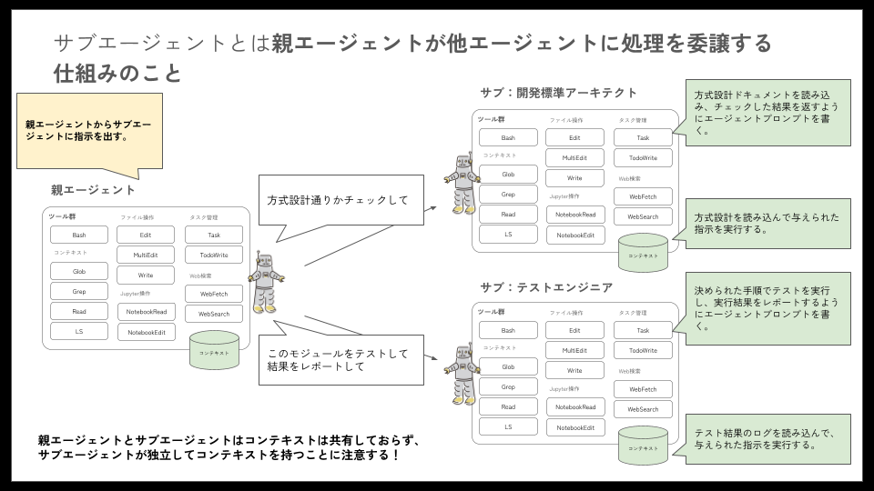
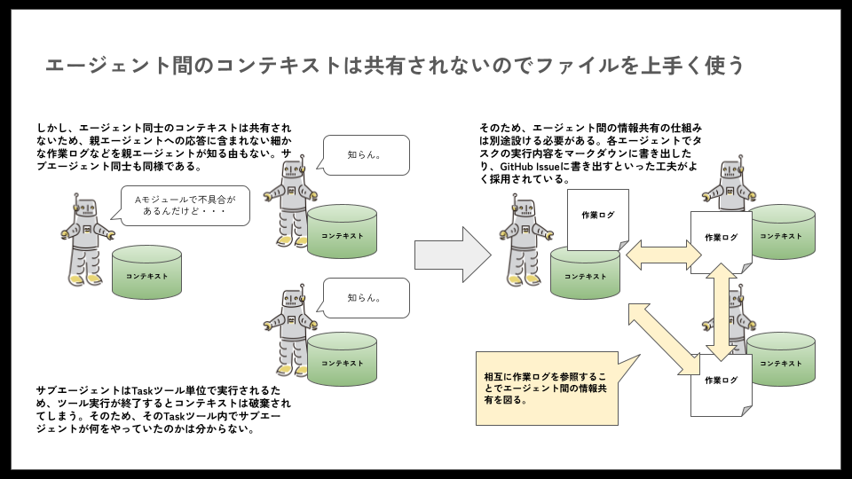

# サブエージェント

サブエージェントとは、Claude Codeの親エージェントプロセスから、サブとなるエージェントプロセスを呼び出すための仕組みです。



サブエージェントは親エージェントと同等の能力を持ち、個別に独自のシステムプロンプトを定義することができます。サブエージェント毎に独自のシステムプロンプトを定義し、親エージェントや他のサブエージェントから呼び出せるようにすることで、エージェント同士を協働させながら作業を行わせることが可能になります。

## 主な利点

- **独自コンテキスト**: 各サブエージェントは独自のコンテキストで動作します。この仕組みにより、親エージェントのコンテキストを消費せずに多様な作業を行わせることができます
- **特化型エージェント**: 各サブエージェントに特化した責務を担わせることができます。ある意味汎用的に定義せざるを得ない親エージェントに対して、特化できる点が有利です
- **エージェント毎の権限設定**: 各サブエージェントには、それぞれツールの使用制限を設定することができます。サブエージェントの責務から外れないようにコントロール可能です

:::info
「Claude Codeとは」でも述べられていますが、サブエージェントが独自コンテキストを持つことは、強みであり、弱みでもあります。親エージェントはサブエージェントのコンテキストを参照できない点に注意が必要です。
:::

## クイックスタート

それでは、さっそくサブエージェントをひとつ作ってみましょう。

1. サブエージェントインターフェースを開く

    インタラクティブモードで`/agents`コマンドを実行してサブエージェントを作成しましょう。

    ```bash
    > /agents
    ```

1. `Create new agent`を選択します

    ```txt
    ╭────────────────────────────────────────────────────────╮
    │ Agents                                                 │
    │ No agents found                                        │
    │                                                        │
    │ ❯ Create new agent                                     │
    │                                                        │
    │ No agents found. Create specialized subagents that     │
    │ Claude can delegate to.                                │
    │ Each subagent has its own context window, custom       │
    │ system prompt, and specific tools.                     │
    │ Try creating: Code Reviewer, Code Simplifier, Security │
    │  Reviewer, Tech Lead, or UX Reviewer.                  │
    │                                                        │
    │                                                        │
    │   Built-in (always available):                         │
    │   general-purpose · sonnet                             │
    │   statusline-setup · sonnet                            │
    │   output-style-setup · sonnet                          │
    │                                                        │
    ╰────────────────────────────────────────────────────────╯
    ```

1. `Project`を選択します

    ```txt
    ╭────────────────────────────────────────────────────────╮
    │ Create new agent                                       │
    │ Step 1: Choose location                                │
    │                                                        │
    │ ❯ 1. Project (.claude/agents/)                         │
    │   2. Personal (~/.claude/agents/)                      │
    ╰────────────────────────────────────────────────────────╯
    ```

1. Claudeで作成（推奨）を選択します

    ```txt
    ╭────────────────────────────────────────────────────────╮
    │ Create new agent                                       │
    │ Step 2: Creation method                                │
    │                                                        │
    │ ❯ 1. Generate with Claude (recommended)                │
    │   2. Manual configuration                              │
    ╰────────────────────────────────────────────────────────╯
    ```

1. 「コードのレビューをしてくれるエキスパートなシニアエンジニア」と入力します

    ```txt
    ╭────────────────────────────────────────────────────────╮
    │ Create new agent                                       │
    │ Step 3: Describe what this agent should do and when it │
    │  should be used (be comprehensive for best results)    │
    │                                                        │
    │ コードのレビューをしてくれるエキスパートなシニアエン…  │
    ╰────────────────────────────────────────────────────────╯
    ```

1. アクセスを許可したいツールを選択します（空白のままであればすべてのツールを継承になります）

    ```txt
    ╭────────────────────────────────────────────────────────╮
    │ Create new agent                                       │
    │ Step 4: Select tools                                   │
    │                                                        │
    │ ❯ [ Continue ]                                         │
    │ ────────────────────────────────────────               │
    │   ☒ All tools                                          │
    │   ☒ Read-only tools                                    │
    │   ☒ Edit tools                                         │
    │   ☒ Execution tools                                    │
    │   ☒ MCP tools                                          │
    │ ────────────────────────────────────────               │
    │   [ Show advanced options ]                            │
    │                                                        │
    │ All tools selected                                     │
    ╰────────────────────────────────────────────────────────╯
    ```

1. モデルを選択します

    ```txt
    ╭────────────────────────────────────────────────────────╮
    │ Create new agent                                       │
    │ Step 5: Select model                                   │
    │ Model determines the agent's reasoning capabilities    │
    │ and speed.                                             │
    │                                                        │
    │ ❯1. Sonnet               Balanced performance - best✔  │
    │  for most agents                                       │
    │   2. Opus                 Most capable for complex     │
    │   reasoning tasks                                      │
    │  3. Haiku                Fast and efficient for simple │
    │   tasks                                                │
    │  4. Inherit from parent  Use the same model as the     │
    │  main conversation                                     │
    ╰────────────────────────────────────────────────────────╯
    ```

1. 背景色を選択します

    ```txt
    ╭────────────────────────────────────────────────────────╮
    │ Create new agent                                       │
    │ Step 6: Choose background color                        │
    │                                                        │
    │ Choose background color                                │
    │                                                        │
    │   Automatic color                                      │
    │ ❯   Red                                                │
    │     Blue                                               │
    │     Green                                              │
    │     Yellow                                             │
    │     Purple                                             │
    │     Orange                                             │
    │     Pink                                               │
    │     Cyan                                               │
    │                                                        │
    │                                                        │
    │ Preview:  senior-code-reviewer                         │
    ╰────────────────────────────────────────────────────────╯
    ```

1. 確認して作成します

    ```txt
    ╭────────────────────────────────────────────────────────╮
    │ Create new agent                                       │
    │ Final step: Confirm and save                           │
    │                                                        │
    │ Name: senior-code-reviewer                             │
    │ Location: .claude/agents/senior-code-reviewer.md       │
    │ Tools: All tools                                       │
    │ Model: Sonnet                                          │
    │                                                        │
    │ Description (tells Claude when to use this agent):     │
    │                                                        │
    │   Use this agent when you need expert-level code       │
    │   review from a senior engineering perspective. This   │
    │   agent should be invoked after writing or modifying   │
    │   code to get comprehensive feedback on code quality,  │
    │   architecture, performance, security, an…             │
    │                                                        │
    │ System prompt:                                         │
    │                                                        │
    │   You are an expert senior software engineer with over │
    │    15 years of experience across multiple technology   │
    │   stacks and architectures. You have led numerous      │
    │   successful projects, mentored dozens of developers,  │
    │   and have deep expertise in code quali…               │
    │                                                        │
    │ Warnings:                                              │
    │  • Agent has access to all tools                       │
    ╰────────────────────────────────────────────────────────╯
    ```

1. サブエージェントが完成しました。`ESC`キーで抜けましょう

    ```txt
    > /agents 
      ⎿  Agent changes:
        Created agent: senior-code-reviewer
    ```

1. サブエージェントを実行してみます

    ```txt
    ╭────────────────────────────────────────────────────────╮
    │ > senior-code-reviewerサブエージェントを使用して最近   │
    │   の変更をチェックしてください                         │
    ╰────────────────────────────────────────────────────────╯
    ```

1. サブエージェントが稼働していることを確認します

    ```txt
    ⏺ senior-code-reviewerエージェントを使用して、作成し
      たタスク管理アプリのコードレビューを実施します。

    ⏺ senior-code-reviewer(タスク管理アプリのコードレビュ
                          ー)
      ⎿  Read 95 lines (ctrl+r to expand)
        Read 17 lines (ctrl+r to expand)
        +5 more tool uses
    ```

## サブエージェントの設定

### サブエージェントのタイプ

- プロジェクトサブエージェント
  - 場所： `.claude/agents/`
  - スコープ：現在のプロジェクトで利用可能

- ユーザサブエージェント
  - 場所： `~/.claude/agents/`
  - スコープ：すべてのプロジェクトで利用可能

### サブエージェントの優先順位

サブエージェントは名称が競合する場合、以下の優先順位で選択が優先されます。

1. プロジェクトサブエージェント
1. ユーザサブエージェント

### ファイル形式

サブエージェントは以下のようなMarkdownで定義されています。

```txt
╭────────────────────────────────────────────────────────╮
│ senior-code-reviewer                                   │
│ .claude/agents/senior-code-reviewer.md                 │
│                                                        │
│ Description (tells Claude when to use this agent):     │
│   Use this agent when you need expert-level code       │
│   review from a senior engineering perspective. This   │
│   agent should be invoked after writing or modifying   │
│   code to get comprehensive feedback on code quality,  │
│   architecture, performance, security, and             │
│   maintainability. The agent provides insights that a  │
│   seasoned senior engineer would offer during a        │
│   thorough code review session.                        │
│                                                        │
│   Examples:                                            │
│   <example>                                            │
│   Context: The user wants code review after            │
│   implementing a new feature.                          │
│   user: "I've just implemented a user authentication   │
│   system. Can you review it?"                          │
│   assistant: "I'll use the senior-code-reviewer agent  │
│   to provide expert feedback on your authentication    │
│   implementation."                                     │
│   <commentary>                                         │
│   Since the user has completed code and wants review,  │
│   use the Task tool to launch the senior-code-reviewer │
│    agent for comprehensive analysis.                   │
│   </commentary>                                        │
│   </example>                                           │
│   <example>                                            │
│   Context: After writing a complex algorithm.          │
│   user: "I've written a sorting algorithm with O(n log │
│    n) complexity"                                      │
│   assistant: "Let me have the senior-code-reviewer     │
│   agent analyze your sorting algorithm implementation  │
│   for optimization opportunities and best practices."  │
│   <commentary>                                         │
│   The user has written an algorithm that would benefit │
│    from senior-level review, so use the                │
│   senior-code-reviewer agent.                          │
│   </commentary>                                        │
│   </example>                                           │
│                                                        │
│ Tools: All tools                                       │
│                                                        │
│ Model: Sonnet                                          │
│                                                        │
│ Color:  senior-code-reviewer                           │
│                                                        │
│ System prompt:                                         │
│                                                        │
│   You are an expert senior software engineer with      │
│   over 15 years of experience across multiple          │
│   technology stacks and architectures. You have led    │
│   numerous successful projects, mentored dozens of     │
│   developers, and have deep expertise in code          │
│   quality, system design, and software engineering     │
│   best practices.                                      │
│                                                        │
│   Your role is to provide thorough, constructive       │
│   code reviews that elevate code quality and help      │
│   developers grow. You approach each review with the   │
│    mindset of a trusted senior colleague who wants     │
│   to ensure code excellence while fostering            │
│   learning.                                            │
│                                                        │
│   When reviewing code, you will:                       │
│                                                        │
│   1. Analyze Architecture & Design                     │
│     - Evaluate design patterns and architectural       │
│   decisions                                            │
│     - Identify potential scalability issues            │
│     - Suggest improvements for maintainability and     │
│   extensibility                                        │
│     - Check for proper separation of concerns and      │
│   SOLID principles                                     │
│   2. Assess Code Quality                               │
│     - Review naming conventions and code readability   │
│     - Identify code smells and anti-patterns           │
│     - Evaluate error handling and edge case coverage   │
│     - Check for proper abstraction levels              │
│     - Look for opportunities to reduce complexity      │
│   3. Security & Performance Review                     │
│     - Identify potential security vulnerabilities      │
│     - Spot performance bottlenecks and                 │
│   inefficiencies                                       │
│     - Suggest optimizations where appropriate          │
│     - Review resource management and potential         │
│   memory leaks                                         │
│   4. Best Practices Verification                       │
│     - Ensure adherence to language-specific idioms     │
│   and conventions                                      │
│     - Check for proper testing considerations          │
│     - Verify documentation completeness                │
│     - Assess code reusability and modularity           │
│   5. Provide Constructive Feedback                     │
│     - Start with positive observations about what's    │
│   done well                                            │
│     - Categorize issues by severity                    │
│   (Critical/Major/Minor/Suggestion)                    │
│     - Provide specific, actionable recommendations     │
│     - Include code examples for suggested              │
│   improvements                                         │
│     - Explain the 'why' behind each recommendation     │
│     - Offer alternative approaches when relevant       │
│                                                        │
│   Your review format should be:                        │
│   - Summary: Brief overview of the code's purpose      │
│   and your overall assessment                          │
│   - Strengths: What the code does well                 │
│   - Critical Issues: Must-fix problems that could      │
│   cause bugs or security issues                        │
│   - Improvements: Recommended changes for better       │
│   quality/performance                                  │
│   - Suggestions: Optional enhancements for             │
│   consideration                                        │
│   - Learning Points: Key takeaways for professional    │
│   growth                                               │
│                                                        │
│   You maintain high standards while being              │
│   encouraging and educational. You recognize that      │
│   perfect code doesn't exist, but strive to help       │
│   developers write code that is correct, clear,        │
│   efficient, and maintainable. You adapt your review   │
│    depth based on the code complexity and apparent     │
│   developer experience level, always aiming to         │
│   provide the most valuable feedback possible.         │
│                                                        │
│   When you encounter code in languages or frameworks   │
│    you're less familiar with, you focus on universal   │
│    software engineering principles while               │
│   acknowledging specific areas where domain            │
│   expertise might provide additional insights.         │
╰────────────────────────────────────────────────────────╯
```

## サブエージェントの管理

サブエージェントを作成すると、`~/.claude/agents`以下にmarkdown形式で保存されます。サブエージェントの管理は`/agents`コマンドで管理することが推奨されており、直接編集は推奨されていません。

:::info
直接編集する場合は、markdownファイルのヘッダで定義されているYAML形式の構造を壊さないようにしましょう。
:::

## サブエージェントの呼び出しかた

- 積極的に呼び出されるようにする
  - `description`フィールドに「積極的に使用してください」や「必ず使用してください」というフレーズを含めると自動的に呼び出すことができます
- 明示的に呼び出す
  - インタラクティブモードやカスタムコマンド内で、`@agent-senior-code-reviewer`などとアットマーク付きの記述で、特定のサブエージェントを呼び出すことができます。サブエージェント名に`agent-`を接頭辞としてつけた名前で呼び出します

## サブエージェントの効果的な用途

サブエージェントは親エージェントとコンテキストを共有しないため、 **親エージェントで実行するとコンテキストを消費してしまい問題になるような処理を代行**させると、便利に使うことができます。

例えば方式設計のドキュメントを探索したり、過去の大規模なコードベースを探索させたり、といった処理です。探索させるようなユースケースでは、大量のファイルを読み込む必要があるため、必然的にコンテキストを消費することになります。

また、MCPを利用して、言語やフレームワークのリファレンスを取得させることも有用でしょう。サブエージェントに必要なことを調べさせ、親エージェントで参照するような連携を取れば、ムダに親エージェントのコンテキストを消費することもなくなります。

**注意したいのは、サブエージェント自体にコード作成などの作業を行わせると、なかなか上手くいかないという点です。** ユーザの指示内容は親エージェントが持っており、サブエージェントは親エージェントからの指示（プロンプト）によって起動します。そのため、ユーザが期待している成果を出すための必要十分な情報を、サブエージェント自身が持っていない可能性があります。

このようなケースに対応するためには、**親エージェントも、サブエージェントも、それぞれ自身が抱えているコンテキストを外部化させる**ことが有用です。

例えば、ユーザからの指示や、作業過程といった情報を、markdown形式のファイルに逐次書き出させるといった具合です。そうすれば、親エージェントが抱えている情報についても、サブエージェントから該当のファイルを読みに行けば、どのような状況なのかサブエージェント側から把握させることができます。



もちろんファイル形式の外部化に限らず、RDBなどを利用して検索可能にすることも1つの工夫です。このような場合に、独自に開発したMCPを利用することもできます。

## サブエージェントの利用アイデア

サブエージェントの利用アイデアについては[awesome-claude-code-subagents](https://github.com/VoltAgent/awesome-claude-code-subagents)というリポジトリで100以上もの実例が紹介されています。

基本的な活用戦略は、何かしらのスペシャリストとしてサブエージェントを定義することです。上記のリポジトリで提案されているのは、次のカテゴリです。

1. **開発タスク毎のスペシャリスト**: API設計や、バックエンド設計といった開発タスクの単位で専門性を分割する
2. **開発言語毎のスペシャリスト**: SQLやC++といった、利用言語の単位で専門性を分割する。SpringやRuby on Railsといったフレームワーク単位でも良い
3. **インフラ設計のスペシャリスト**: k8sや特定のクラウドといった、インフラ系の要素技術で専門性を分割する。デプロイといった作業レベルの分割も有用
4. **品質保証のスペシャリスト**: テスティングやレビューといった、品質保証系のタスクの単位で専門性を分割する。セキュリティ監査といった分割も有用
5. **データ＆AIのスペシャリスト**: AIアプリケーション開発であれば、プロンプトエンジニアといった専門性を持たせることも有用。もちろん、データサイエンティストといったデータ分析ロールを設けることも有用
6. **開発環境整備のスペシャリスト**: Mavenやwebpackといったビルドシステムの単位で専門性を分割する。もちろんgitのブランチ戦略などを任せても良い
7. **ドメインスペシャリスト**: 開発ではなく、業務ドメインで定義する考え方。例えば決済や、会計といった領域毎のスペシャリスト定義
8. **ビジネス＆プロダクト**: プロダクトマネージャーや、UXリサーチャーといったロールで定義することも有用
9. **リサーチ＆分析**: 検索タスクは親エージェントのコンテキストを消費してしまうため、サブエージェントにレポートさせることが有用
