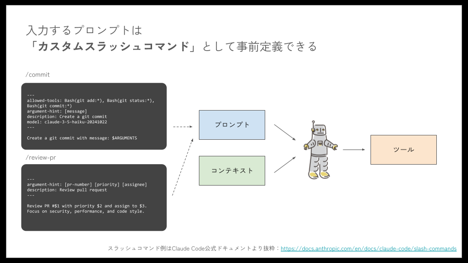

# カスタムコマンド

カスタムコマンド（スラッシュコマンド）は、頻繁に使用するプロンプトやワークフローを再利用可能なコマンドとして定義する機能です。コマンドとして定義することにより、チームの知識とベストプラクティスを標準化し、チーム単位の開発効率を向上させるようにマネジメントすることも可能です。


©株式会社ジェネラティブエージェンツ / [はじめてのClaude Code](https://www.youtube.com/watch?v=D5tjsGEYUI4) ※引用画像は本サイト利用規約に基づく自由な使用、複製、翻案等の対象外です。

## カスタムコマンドの作り方

### 1. 基本的なコマンド作成

Claude Codeのカスタムコマンドは、Markdownファイル（`.md`）として作成します。YAMLフロントマターを使用してメタデータを定義できます。

#### 引数プレースホルダーの仕組み

Claude Codeでは、以下の特殊な変数を使って引数を受け取ることができます。

- **`$ARGUMENTS`**: すべての引数を1つの文字列として受け取ります
  - 例： `/create-entity User users` → `$ARGUMENTS` = "User users"
- **`$1`, `$2`, `$3`...**: 位置引数として個別に受け取ります
  - 例： `/create-entity User users` → `$1` = "User", `$2` = "users"

**シンプルなコマンド例:**

```markdown
# .claude/commands/create-entity.md
---
argument-hint: <クラス名> <テーブル名> <フィールド定義>
description: JPA エンティティクラスを作成
allowed-tools: Edit, Write, Read
---

以下の仕様でJPAエンティティクラスを作成してください：

## 基本要件
- クラス名: $1
- テーブル名: $2
- フィールド定義: $3

## 技術要件
- JPA アノテーションを使用
- BaseEntity を継承
- バリデーションアノテーションを適用
- toString, equals, hashCode メソッドを実装

## コーディング規約
- Google Java Style Guide準拠
- JavaDoc コメントを含む
- フィールドはprivateで定義
- 適切なコンストラクタを提供

実装時は、フィールド定義を解析して適切な型とアノテーションを適用してください。
```

- `argument-hint`: コマンド使用時に表示される引数のヒント
- `description`: `/help`で表示されるコマンドの説明
- `allowed-tools`: このコマンドで使用可能なツールを制限（セキュリティ向上）

**使用例:**

```bash
/create-entity User users "name:String:@NotBlank,email:String:@Email,age:Integer:@Min(0)"
```

### 2. 複雑なワークフローのコマンド化

#### 複数引数の活用とデフォルト値

複数の引数を使用する場合、必須引数とオプション引数を組み合わせることができます。引数が省略された場合の処理も記述できます。

**CRUD機能一括生成コマンド:**

```markdown
# .claude/commands/generate-crud.md
---
argument-hint: <エンティティ名> <フィールド定義> [検索対象フィールド]
description: 完全なCRUD機能を一括生成
---

指定されたエンティティに対するCRUD機能を作成してください。

## 対象エンティティ
- エンティティ名: $1
- 主要フィールド: $2
- 検索対象フィールド: $3  # 省略可能な第3引数

## 生成するファイル
1. $1.java (エンティティ)
2. $1Dto.java (DTO)
3. Create$1Request.java (作成リクエスト)
4. Update$1Request.java (更新リクエスト)
5. $1Response.java (レスポンス)
6. $1Repository.java (リポジトリ)
7. $1Service.java (サービス)
8. $1Controller.java (コントローラー)

## 技術仕様
- Spring Boot 3.x
- Spring Data JPA
- Bean Validation
- MapStruct (DTO変換)
- OpenAPI/Swagger対応

## 機能要件
- 基本CRUD操作（Create, Read, Update, Delete）
- ページング対応（Spring Data Pageableを使用）
- 検索機能（$3で検索可能）
- ソート機能
- 適切なHTTPステータスコード
- グローバル例外ハンドリング

## 品質要件
- 単体テスト（JUnit 5、Mockito使用）
- 結合テスト（TestContainersを使用）
- API仕様書（OpenAPI 3.0準拠）
- JavaDoc コメント完備

各ファイルを順番に生成し、相互の整合性を確保してください。
生成後、すべてのファイルがコンパイル可能であることを確認してください。
```

- `argument-hint`: 引数のヒントを表示
- `description`: コマンドの説明
- `$3`: 第3引数（オプション）を参照

### 3. テスト生成専用コマンド

#### ファイル参照機能（@プレフィックス）の活用

`@`プレフィックスを使用すると、ファイルの内容を直接コマンドに含めることができます。これにより、既存のコードを参照して処理を行うことが可能です。

**単体テスト生成コマンド:**

```markdown
# .claude/commands/generate-unit-tests.md
---
argument-hint: <テスト対象ファイルパス>
description: 単体テストを生成
allowed-tools: Read, Write, Edit, Bash
---

以下のクラスの単体テストを作成してください。

## 対象クラス
@$1  # ファイルパスを指定して内容を読み込み

## テスト要件
- 全publicメソッドのテスト
- 正常系・異常系・境界値テスト
- モックを使用した依存関係の分離
- カバレッジ90%以上を目標

## 技術仕様
- JUnit 5
- Mockito（モック作成）
- AssertJ（アサーション）

## テスト設計原則
- Given-When-Then形式でテストケースを構成
- 日本語で意味のあるテストメソッド名（@DisplayNameアノテーション使用）
- 適切なアサーション（AssertJを活用）
- テストデータビルダーパターンの使用

## 出力形式
テストクラスを生成し、実行可能な状態で提供してください。
テスト実行コマンドも併せて提示してください（例: mvn test）。
```

`@`プレフィクスを利用するとファイルを参照させることができます。

- `@$1`: 第1引数で指定されたファイルパスの内容を読み込みます
- `@src/main/java/User.java`: 固定パスのファイルを読み込みます
- 複数ファイルを参照する場合： `@file1.java @file2.java`のように並べます

**使用例:**

```bash
/generate-unit-tests src/main/java/com/example/UserService.java
```

### 4. コードレビュー専用コマンド

#### Bashコマンド実行機能（!プレフィックス）の活用

`!`プレフィックスを使用すると、Bashコマンドを実行し、その結果をプロンプトに含めることができます。これにより、システム情報やプロジェクトの状態を動的に取得できます。

**コードレビューコマンド:**

```markdown
# .claude/commands/code-review.md
---
argument-hint: [ファイルパスまたはディレクトリ] [重点レビュー観点]
description: 包括的なコードレビューを実行
model: claude-4-sonnet
---

## レビュー準備

### プロジェクト情報の収集
!echo "プロジェクト构成:"
!ls -la $1

### 依存関係の確認
!test -f pom.xml && echo "Mavenプロジェクトを検出" || echo ""
!test -f package.json && echo "Node.jsプロジェクトを検出" || echo ""

## レビュー対象
@$1  # 指定されたファイルまたはディレクトリの内容を読み込み

## レビュー観点

### 1. セキュリティ ($2が指定された場合はその観点を重視)
- SQLインジェクション脆弱性
- XSS攻撃対策
- 認証・認可の適切性
- 機密情報の漏洩リスク
- CSRF対策
- 入力値検証

### 2. パフォーマンス
- N+1問題の確認
- メモリリークの可能性
- アルゴリズムの最適性
- データベースクエリの効率性
- キャッシュの活用

### 3. 保守性
- コードの可読性
- 単一責任の原則 (SRP)
- DRY原則の遵守
- 適切な抽象化
- モジュールの凝集度

### 4. 品質
- エラーハンドリングの完全性
- ログ出力の適切性
- テスタビリティ
- ドキュメントの充実度

### 5. 規約遵守
- コーディング規約の遵守
- 命名規則の一貫性
- アーキテクチャパターンへの準拠

## 出力形式
1. **問題の重要度別分類**
   - 🔴 Critical: 即座に修正が必要
   - 🟠 High: 早急に修正を推奨
   - 🟡 Medium: 改善が望ましい
   - 🟢 Low: 参考情報

2. **具体的な問題箇所の指摘**
   - ファイル名:行番号の形式で明示

3. **改善提案と修正例**
   - 具体的なコード例を提示

4. **総合評価**
   - 10点満点でスコアリング
   - 次のステップの提案
```

`!`プレフィクスを利用すると、コマンドの出力結果がプロンプトに含まれ、Claude Codeが参照します。

- `!ls -la`: ディレクトリ内容を一覧表示
- `!test -f ファイル名 && コマンド`: ファイルが存在する場合のみコマンド実行
- `!git log --oneline -5`: 最近のコミット履歴を取得

**使用例:**

```bash
/code-review src/main/java/UserService.java security
```

## 実践的なコマンド例

### 1. Spring Boot プロジェクト初期化

**プロジェクト初期化コマンド:**

```markdown
# .claude/commands/init-spring-project.md
---
argument-hint: <プロジェクト名> <パッケージ名> [説明]
description: Spring Bootプロジェクトの初期構造を作成
model: claude-4-sonnet  # 高性能モデルを指定
allowed-tools: Write, Edit, Bash  # ファイル操作とBashコマンドのみ許可
---

Spring Bootプロジェクトの初期構造を作成します。

## プロジェクト情報
- プロジェクト名: $1
- パッケージ名: $2
- 説明: $3  # 省略可能な第3引数

## 環境確認
!java --version
!mvn --version

## 技術スタック
- Spring Boot 3.2.x
- Spring Data JPA
- Spring Security 6.x
- PostgreSQL
- Redis
- Maven
- Java 17+

## 生成するファイル

### 1. Maven設定
- pom.xml（必要な依存関係をすべて含む）

### 2. アプリケーション設定
- src/main/resources/application.yml
- src/main/resources/application-dev.yml
- src/main/resources/application-prod.yml

### 3. Javaソースコード
- $2.Application.java（メインクラス）
- $2.config.SecurityConfig.java
- $2.config.DatabaseConfig.java
- $2.config.RedisConfig.java
- $2.entity.BaseEntity.java
- $2.exception.BusinessException.java
- $2.exception.GlobalExceptionHandler.java

### 4. Docker設定
- Dockerfile
- docker-compose.yml
- .dockerignore

### 5. ドキュメント
- README.md
- .gitignore

## ディレクトリ構造

$1/
├── src/
│   ├── main/
│   │   ├── java/
│   │   │   └── $2/
│   │   │       ├── config/
│   │   │       ├── controller/
│   │   │       ├── service/
│   │   │       ├── repository/
│   │   │       ├── entity/
│   │   │       ├── dto/
│   │   │       ├── exception/
│   │   │       └── util/
│   │   └── resources/
│   └── test/
├── pom.xml
├── Dockerfile
├── docker-compose.yml
└── README.md

レイヤードアーキテクチャに適した構成でプロジェクトを作成します。
生成後、Mavenコマンドでビルド可能であることを確認します。
```

- `model`: 使用するモデルを指定（モデルの自動切り替えに伴う不安定さをなくしたい場合）
- `allowed-tools`: 使用可能なツールを制限（コマンドの動作チューニングに有用）

**使用例:**

```bash
/init-spring-project my-app com.example.myapp "ECサイトのAPIサーバ"
```

### 2. データベースマイグレーション生成

**マイグレーション生成コマンド:**

```markdown
# .claude/commands/create-migration.md
---
argument-hint: <変更内容> <バージョン> <説明>
description: Flywayマイグレーションスクリプトを生成
allowed-tools: Write, Read, Bash
---

Flywayマイグレーションスクリプトを作成します。

## 変更内容
$1

## バージョン情報
- バージョン: $2
- 説明: $3
- ファイル名: V$2__$3.sql

## 現在のデータベーススキーマ確認

### 既存マイグレーションの確認
!find src/main/resources/db/migration -name "*.sql" | sort | tail -5

### データベース設定の確認
@src/main/resources/application.yml

## 技術要件
- PostgreSQL対応
- ロールバック可能な設計
- インデックス最適化
- 制約の適切な設定

## マイグレーションスクリプトの作成

### 1. 前方マイグレーション（V$2__$3.sql）
以下の内容を含むSQLスクリプトを作成：
- トランザクション境界の明示
- 詳細なコメント
- パフォーマンスを考慮したインデックス設定
- 外部キー制約の適切な設定

### 2. ロールバックスクリプト（U$2__$3.sql）
必要に応じてロールバック用SQLを作成：
- データのバックアップを考慮
- 依存関係の確認

### 3. 安全性考慮
- 本番環境での実行を考慮
- データ損失リスクの評価
- パフォーマンスへの影響評価

## 実行前チェックリスト
- [ ] バックアップの作成
- [ ] テスト環境での検証
- [ ] 影響を受けるアプリケーションの確認
- [ ] ロールバック手順の確認
- [ ] 実行時間の推定

## 想定実行時間とリスク評価
変更内容に基づいて評価します。
```

**使用例:**

```bash
/create-migration "ユーザプロフィールテーブルを追加" 1.4 add_user_profile_table
```

### 3. API仕様書生成

**API仕様書生成コマンド:**

```markdown
# .claude/commands/generate-api-spec.md
---
argument-hint: <コントローラーファイル> <API名> [APIバージョン] [API説明]
description: OpenAPI仕様書を生成
model: claude-4-sonnet
allowed-tools: Read, Write, Bash
---

OpenAPI 3.0仕様書を生成します。

## 基本情報
- API名: $2
- APIバージョン: $3  # 省略可能（デフォルト: 1.0.0）
- API説明: $4  # 省略可能（デフォルト: RESTful API）

## プロジェクト構成の確認
!echo "プロジェクトタイプの検出:"
!test -f pom.xml && echo "- Spring Boot (Maven)" || echo ""
!test -f build.gradle && echo "- Spring Boot (Gradle)" || echo ""
!test -f package.json && echo "- Node.js/Express" || echo ""

## コントローラーの解析

### 対象コントローラー
@$1

### 関連するモデルクラスの検出
!echo "関連モデルの探索:"
!find . -name "*Request.java" -o -name "*Response.java" -o -name "*Dto.java" | grep -E "(Request|Response|Dto)\.java$" | head -10

## OpenAPI仕様書の生成

以下の内容を含むYAML形式の仕様書を作成します：

### 1. 基本情報

openapi: 3.0.3
info:
  title: $2
  version: $3
  description: $4
  contact:
    name: API Support
  license:
    name: Apache 2.0
servers:
  - url: http://localhost:8080
    description: Development server
  - url: https://api.example.com
    description: Production server

### 2. セキュリティ定義
- JWT Bearer認証
- APIキー認証
- OAuth2フロー（必要に応じて）

### 3. エンドポイント仕槕
コントローラーから抽出した情報を基に：
- 各エンドポイントのパス
- HTTPメソッド
- リクエスト/レスポンススキーマ
- パラメーター（パス、クエリ、ボディ）
- HTTPステータスコード別のレスポンス

### 4. コンポーネントスキーマ
- リクエスト/レスポンスモデル
- 共通エラーレスポンス
- ページネーションモデル

### 5. サンプルデータ
各エンドポイントに対して：
- リクエストのサンプル
- 成功レスポンスのサンプル
- エラーレスポンスのサンプル

## 出力ファイル
- openapi.yaml（メイン仕様書）
- README.md（使用方法とAPI概要）

## 検証
生成した仕様書をSwagger EditorやOpenAPI Generatorで検証できるようにします。
```

**使用例:**

```bash
/generate-api-spec src/main/java/UserController.java "User Management API" 2.0.0 "ユーザ管理のためのRESTful API"
```

## チーム共有の仕組み

### 1. コマンドの共有方法

Claude Codeのカスタムコマンドの設定場所は、プロジェクト単位と個人単位の2種類に分かれます。

**Gitリポジトリでの管理:**

```markdown
# プロジェクト単位（チームで共有）
.claude/
└── commands/
    ├── create-entity.md      # エンティティ作成
    ├── generate-tests.md     # テスト生成
    ├── code-review.md        # コードレビュー
    ├── generate-crud.md      # CRUD機能生成
    ├── init-spring.md        # Spring Boot初期化
    └── db-migration.md       # DBマイグレーション

# 個人単位（個人の環境で管理）
~/.claude/
└── commands/
    ├── personal-review.md    # 個人用レビューコマンド
    └── my-template.md        # 個人用テンプレートコマンド
```

**コマンドの優先順位:**
1. プロジェクトコマンド（`.claude/commands/`）
2. 個人コマンド（`~/.claude/commands/`）

同名のコマンドがある場合、プロジェクトのディレクトリに格納されているコマンドが優先されます。

### 2. ネームスペース

コマンドはネームスペースに分けて管理することができます。例えばチームを横断した汎用的なコマンド群を提供する場合などに、元々チームで定義していたコマンド名との衝突を防げます。

**ネームスペースを使った管理:**

```markdown
# .claude/commands/test/unit.md
---
argument-hint: <テスト対象ファイル>
description: 単体テストを生成 (test)
---
単体テストを生成します...
```

**使用例:**

```bash
# ネームスペース付きコマンド
/test:unit UserService.java
/db:migrate "usersテーブル追加"
/review:security src/
```

### 3. コマンドのドキュメント化

プロジェクトで利用しているコマンドは、README.mdなどにドキュメント化しておくと便利です。次に示すのは、ドキュメント化の例です。

**READMEでのコマンド一覧管理:**

```markdown
# .claude/commands/README.md

# プロジェクトカスタムコマンド一覧

## 基本コマンド

| コマンド | 説明 | 引数 |
|---------|------|------|
| `/create-entity` | JPAエンティティを作成 | `<クラス名> <テーブル名> <フィールド>` |
| `/generate-crud` | CRUD機能一式生成 | `<エンティティ名> <フィールド>` |
| `/generate-tests` | テストコード生成 | `<ファイルパス> [テストタイプ]` |
| `/code-review` | コードレビュー実行 | `<ファイル/ディレクトリ> [重点]` |

## プロジェクト初期化

| コマンド | 説明 | 引数 |
|---------|------|------|
| `/init-spring` | Spring Bootプロジェクト初期化 | `<名前> <パッケージ>` |
| `/db-migration` | DBマイグレーション作成 | `<変更> <Ver> <説明>` |
| `/api-spec` | OpenAPI仕様書生成 | `<コントローラ> <API名>` |

## 使用例

### エンティティ作成
/create-entity User users "name:String,email:String,age:Integer"

### テスト生成
/generate-tests src/main/java/UserService.java "unit,integration"

### コードレビュー
/code-review src/ security

## コマンド作成ガイドライン

1. コマンド名は短く分かりやすく
2. 引数は必須とオプションを明確に
3. 日本語での指示を基本とする
4. エラー処理を含める
5. テストしてからコミットする
```

### 3. エラーハンドリング

Claude Codeはコマンド内で定義されているフローに忠実に実行しますが、時には生成中に予期せぬアクシデントが発生します。アクシデントが発生した場合でも、自己修正ができるように、エラーハンドリングをコマンド内に含めておくと、エージェントのレジリエンスが強化されます。

**堅牢なコマンド設計:**

```markdown
以下の仕様でエンティティクラスを作成してください：

## 入力検証
まず、以下の入力値を検証してください：
- エンティティ名: $1 （PascalCase形式か確認）
- フィールド: $2 （正しい形式か確認）

入力値に問題がある場合は、具体的な修正方法を提示してください。

## エラー時の対応
生成中にエラーが発生した場合は：
1. エラーの原因を明確に説明
2. 修正方法を具体的に提示
3. 代替案があれば提案

## 品質保証
生成したコードは以下を確認してください：
- コンパイルエラーがないこと
- 命名規則に準拠していること
- 必要なインポート文が含まれていること
```

## カスタムコマンドの活用のポイント

### 開発フローに沿ってカスタムコマンドを定義する

カスタムコマンドを上手く定義するポイントは、よくある開発の手順に従って、それぞれの手順で必要とさせる作業をワークフローとして定義することです。

例えばスペック駆動開発であれば、次のような順序で開発が展開します。

1. 要求仕様の作成
2. 要求を満たす設計ドキュメントの作成
3. 設計を実現するための開発タスクの分割
4. それぞれのタスクの実行

このそれぞれについてコマンドを定義すると、例えば次のようになります。

1. `/create-requirements`: 要求仕様の作成
2. `/create-design`: 設計ドキュメントの作成
3. `/create-tasks`: 開発タスクの作成
4. `/implement-tasks`: 実装の実行

それぞれのコマンドを実装することで、スペック駆動開発をカスタムコマンドで実現することができます。

### 開発でよくあるシーンをカスタムコマンドで定義する

他にも、開発でよくあるシーンを切り取って、カスタムコマンドで定義すると便利です。

例えばある機能を開発する際に、既存機能への影響調査が必要なことは、多々あります。このようなケースでは、影響調査の手順をコマンド化することで、品質の安定した影響調査を自動でClaude Codeに行わせることが可能です。

あるいは、GitHubやGitLabのイシューから、実際のコードベースを見た上での開発計画を作成して欲しいときもあるでしょう。このような場合も、イシューのURLから開発計画を作成するコマンドを用意すると便利です。
