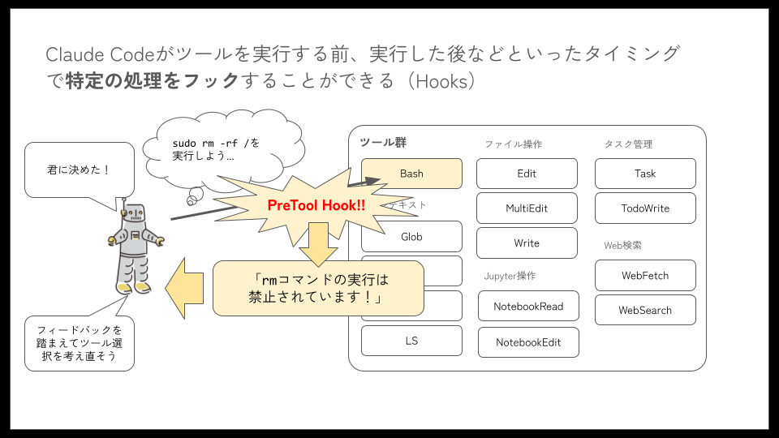

# フック

Claude Codeをプロンプトベースではなく、ルールベースで制御したい場合に活用できるのが「フック」です。フックを利用すると、あらかじめ定義されているフックタイプに応じたイベントをトリガーに、任意のスクリプトを実行させることができます。



## フックイベント

フックには次のタイプがあります。これらのフックを使い分けながら、ルールベースでClaude Codeを制御します。

| フックタイプ | 説明 |
|-------------|------|
| PreToolUse | ツール呼び出しの前に実行（ブロック可能） |
| PostToolUse | ツール呼び出し完了後に実行 |
| UserPromptSubmit | ユーザがプロンプトを送信したときに、Claudeが処理する前に実行 |
| Notification | Claude Codeが通知を送信するときに実行 |
| Stop | Claude Codeが応答を終了するときに実行 |
| SubagentStop | サブエージェントタスクが完了するときに実行 |
| PreCompact | Claude Codeがコンパクト操作を実行しようとする前に実行 |
| SessionStart | Claude Codeが新しいセッションを開始するか既存のセッションを再開するときに実行 |
| SessionEnd | Claude Codeセッションが終了するときに実行 |

## フックの主な用途

フックは以下のような用途で利用できます。

- **ユーザ入力待ちの通知**: Claude Codeがユーザの入力待ち状態になったとき、通知します
- **自動フォーマット**: ソースコードのファイル編集後にフォーマッターを実行することで整形の管理の手間を削減します
- **ログ記録**: 実行されたすべてのコマンドを追跡し、集計します
- **フィードバック**: 生成したコードがコード規約違反の場合にフィードバックをおこないます
- **書き込みのブロック**: 本番ファイルや機密ディレクトリへの変更をブロックします

## クイックスタート

### 前提条件

コマンドラインでのJSON処理のために`jq`をインストールしてください。

### 1. フック設定を開く

`/hooks` スラッシュコマンドを実行して、`PreToolUse`フックイベントを選択します。

```txt
> /agents 
  ⎿  (no content)
╭────────────────────────────────────────────────────────╮
│ Hook Configuration                                     │
│                                                        │
│ Hooks are shell commands you can register to run       │
│ during Claude Code processing. Docs                    │
│ • Each hook event has its own input and output         │
│ behavior                                               │
│ • Multiple hooks can be registered per event, executed │
│  in parallel                                           │
│ • Any changes to hooks outside of /hooks require a     │
│ restart                                                │
│ • Timeout: 60 seconds                                  │
│                                                        │
│ ╭────────────────────────────────────────────────────╮ │
│ │ ⚠ CRITICAL SECURITY WARNING - USE AT YOUR OWN      │ │
│ │ RISK                                               │ │
│ │ Hooks execute arbitrary shell commands with YOUR   │ │
│ │ full user permissions without confirmation.        │ │
│ │ • You are SOLELY RESPONSIBLE for ensuring your     │ │
│ │ hooks are safe and secure                          │ │
│ │ • Hooks can modify, delete, or access ANY files    │ │
│ │ your user account can access                       │ │
│ │ • Malicious or poorly written hooks can cause      │ │
│ │ irreversible data loss or system damage            │ │
│ │ • Anthropic provides NO WARRANTY and assumes NO    │ │
│ │ LIABILITY for any damages resulting from hook      │ │
│ │ usage                                              │ │
│ │ • Only use hooks from trusted sources to prevent   │ │
│ │ data exfiltration                                  │ │
│ │ • Review the hooks documentation before proceeding │ │
│ ╰────────────────────────────────────────────────────╯ │
│                                                        │
│ Select hook event:                                     │
│ ❯ 1. PreToolUse - Before tool execution                │
│   2. PostToolUse - After tool execution                │
│   3. Notification - When notifications are sent        │
│   4. UserPromptSubmit - When the user submits a prompt │
│ ↓ 5. SessionStart - When a new session is started      │
╰────────────────────────────────────────────────────────╯
   Enter to acknowledge risks and continue · Esc to exit
```

### 2. マッチャーを追加

`+ Add new matcher…`を選択して、Bashツール呼び出しのみでフックを実行します。

マッチャーに`Bash`と入力します。

```txt
> /agents 
  ⎿  (no content)
╭────────────────────────────────────────────────────────╮
│ Add new matcher for PreToolUse                         │
│                                                        │
│ Input to command is JSON of tool call arguments.       │
│ Exit code 0 - stdout/stderr not shown                  │
│ Exit code 2 - show stderr to model and block tool call │
│ Other exit codes - show stderr to user only but        │
│ continue with tool call                                │
│                                                        │
│                                                        │
│ Possible matcher values for field tool_name:           │
│                                                        │
│ Task, Bash, Glob, Grep, LS, ExitPlanMode, Read, Edit,  │
│ MultiEdit, Write, NotebookEdit, WebFetch, WebSearch,   │
│ BashOutput, KillBash, mcp__ide__getDiagnostics,        │
│ mcp__ide__executeCode                                  │
│                                                        │
│ Tool matcher:                                          │
│ ╭────────────────────────────────────────────────────╮ │
│ │ Bash                                               │ │
│ ╰────────────────────────────────────────────────────╯ │
│                                                        │
│ Example Matchers:                                      │
│ • Write (single tool)                                  │
│ • Write|Edit|MultiEdit (multiple tools)                │
│ • Web.* (regex pattern)                                │
╰────────────────────────────────────────────────────────╯
   Enter to confirm · Esc to cancel
```

### 3. フックを追加

` + Add new hook… `を選択し、このコマンドを入力します。

```bash
jq -r '"\(.tool_input.command) - \(.tool_input.description // "No description")"' >> ~/.claude/bash-command-log.txt
```

### 4. 設定を保存

保存場所を聞かれるので、ホームディレクトリにログを記録するために`User settings`を選択します。

```txt
> /agents 
  ⎿  (no content)
╭────────────────────────────────────────────────────────╮
│ Save hook configuration                                │
│                                                        │
│   Event: PreToolUse - Before tool execution            │
│   Matcher: Bash                                        │
│   Command: jq -r '"\(.tool_input.command) -            │
│   \(.tool_input.description // "No description")"'     │
│   >> ~/.claude/bash-command-log.txt                    │
│                                                        │
│ Where should this hook be saved?                       │
│                                                        │
│ ❯ 1. Project settings (local)  Saved in                │
│   .claude/settings.local.json                          │
│   2. Project settings          Checked in at           │
│   .claude/settings.json                                │
│   3. User settings             Saved in at             │
│   ~/.claude/settings.json                              │
╰────────────────────────────────────────────────────────╯
```

REPLをescで抜けたら完了です。

### 5. フックの確認

`~/.claude/settings.json`をチェックして設定が保存されていることを確認します。

```json
{
  "hooks": {
    "PreToolUse": [
      {
        "matcher": "Bash",
        "hooks": [
          {
            "type": "command",
            "command": "jq -r '\"\\(.tool_input.command) - \\(.tool_input.description // \"No description\")\"' >> ~/.claude/bash-command-log.txt"
          }
        ]
      }
    ]
  }
}
```

### 6. フックをテスト

Claude Codeにコマンドを実行させ、ログファイルを確認したら完了です。

その他、便利な例については[公式ドキュメント](https://docs.anthropic.com/ja/docs/claude-code/hooks-guide#%E3%82%B3%E3%83%BC%E3%83%89%E3%83%95%E3%82%A9%E3%83%BC%E3%83%9E%E3%83%83%E3%83%88%E3%83%95%E3%83%83%E3%82%AF)を参照してください。

## 設定

フックの設定は`settings.json`で設定されます。

### 構造・記述方法

- イベントごとにマッチャーが設定でき、1つのマッチャーに複数のフックを持つことができます
  - イベントごとに使えるマッチャーには違いがあります
- マッチャーを使用しないトリガイベントの場合はマッチャーを省略してフックを設定します

フックの書き方・設定方法の詳細については[公式ドキュメント](https://docs.anthropic.com/ja/docs/claude-code/hooks)を参照してください。

## セキュリティ考慮事項

フックでは任意のスクリプトを実行させることができます。非常に強力な機能であるため、自己責任での使用が免責事項に定められています。内容によっては、ユーザにアクセス権のある、あらゆるファイルを変更・削除できてしまうため、利用の際はスクリプト内に破壊的な振る舞いが記述されていないか、入念に確認を行ってください。**特に、フックで利用するスクリプト自体をClaude Codeに書かせた場合、破壊的なコードが意図せず紛れ込むことは多々あるため、注意してください。**

## 便利な活用例

次に挙げるのは、よく利用される外部フックの事例です。

### [CCNotify](https://github.com/dazuiba/CCNotify) - デスクトップ通知で作業効率を向上

<!-- textlint-disable prh -->
Claude Codeで長時間のタスクを実行している間、別の作業に集中していると、いつタスクが完了したのか、いつユーザの入力が必要になったのか気づきにくいという問題があります。CCNotifyはこの問題を解決するデスクトップ通知フックです。タスクの完了時やユーザ入力が必要になったタイミングで通知を送信し、ワンクリックでVS Codeに戻ることができます。さらに、タスクの実行時間も表示されるため、作業の効率性を把握することも可能です。
<!-- textlint-enable prh -->

### [TDD Guard](https://github.com/nizos/tdd-guard) - テストファースト開発の強制

テスト駆動開発（TDD）を実践しようとしても、つい実装コードを先に書いてしまうことはよくあります。TDD Guardは、ファイル操作をリアルタイムで監視し、テストが存在しない実装コードの作成を自動的にブロックするフックです。これにより、チーム全体でTDDの原則を確実に守ることができ、コードの品質とテストカバレッジを高水準で維持できます。

### [TypeScript Quality Hooks](https://github.com/bartolli/claude-code-typescript-hooks) - 自動品質管理

TypeScriptプロジェクトにおいて、コード品質を一定に保つことは重要ですが、手動でのチェックは時間がかかります。TypeScript Quality Hooksは、Claude Codeがコードを編集するたびに自動的に品質チェックを実行します。

主な機能は以下の通りです。
- TypeScriptのコンパイルチェック
- ESLintによる問題の自動修正
- Prettierによるコードフォーマット
- SHA256ハッシュによる設定キャッシュで高速化

### フック開発を支援するSDK群

複雑なフックロジックを実装する場合、適切なSDKを使用することで開発効率が大幅に向上します。

**[cchooks](https://github.com/GowayLee/cchooks)（Python SDK）** は、Pythonでフックスクリプトを書く際に便利に活用できるSDKです。例えば、`Hook().block("テストが存在しません")`のような直感的なコードで、ツールの実行をブロックし、エラーメッセージを返すことができます。JSONの手動操作が不要になり、Pythonの型ヒントによるコード補完も利用できるため、複雑なフック処理を素早く実装できます。

**[claude-hooks-sdk](https://github.com/beyondcode/claude-hooks-sdk)（PHP SDK）** は、Laravelから着想を得たfluent APIを採用しています。`HookResponse::create()->block()->withMessage('権限が不足しています')`のようなメソッドチェーンで、読みやすく保守しやすいコードを書けます。Composerでインストール可能で、既存のPHPプロジェクトにフックを統合する際に特に有用です。

**[claude-hooks](https://github.com/johnlindquist/claude-hooks)（TypeScript）** は、型安全なフック設定システムを提供します。複数のフックを一括管理し、フック間での状態共有や条件分岐ロジックを実装できます。例えば、特定のディレクトリへの書き込みを監視し、プロジェクトの設定に基づいて動的に制御するような高度な処理が可能です。

### [総合品質管理フック](https://github.com/Veraticus/nix-config/tree/main/home-manager/claude-code/hooks)

Go言語で実装された「Linting, Testing, and Notifications Hook」は、コード品質管理に必要な機能を統合したフックです。リンティング、テスト実行、通知機能を1つのフックに統合することで、開発プロセス全体の品質管理を自動化します。詳細な設定ファイルのサンプルも提供されており、プロジェクトの要件に合わせてカスタマイズすることができます。
