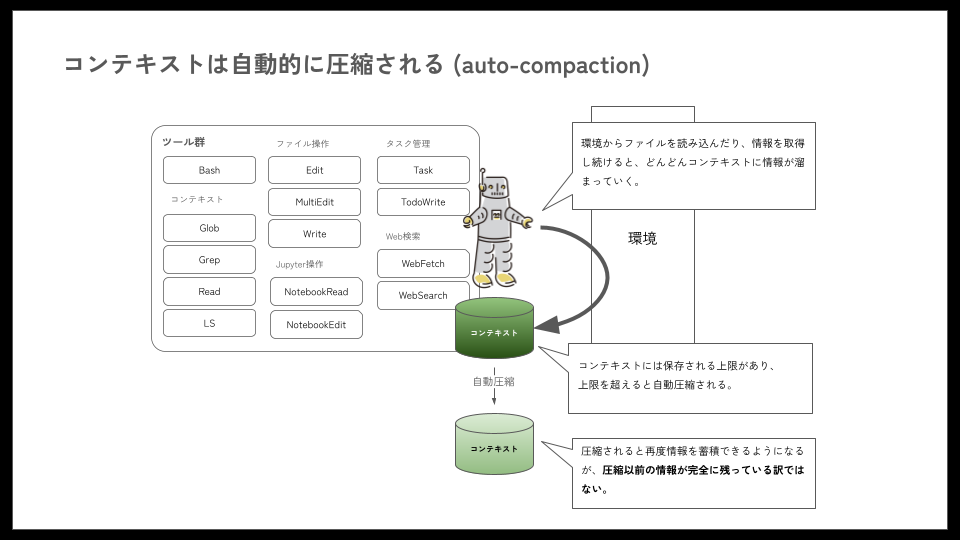
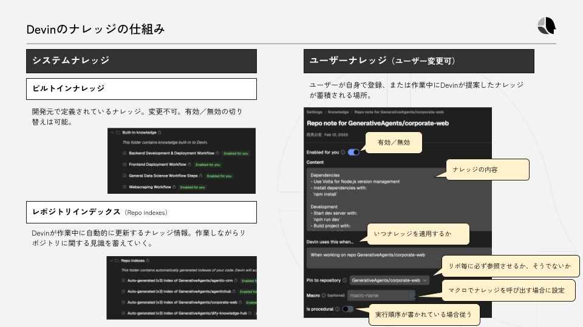

# コンテキストエンジニアリング

コンテキストエンジニアリングとは、LLMを用いるAIエージェントにおいて、**「LLMの限られたコンテキスト長の制約の下で、タスク遂行に最大限有用な情報を詰め込むためにはどうすれば良いのか」** という問題にアプローチするための枠組みを指します。

Claude CodeもLLMを用いたAIエージェントなので、使いこなすためにコンテキストエンジニアリングの知識は知っていて損はないでしょう。

例えば、Claude Codeのコンテキスト長は、内部で使用しているClaudeモデルの制約に依存します。この制約に対処するコンテキストエンジニアリングの一環として、ファイルの読み書きなどを行ってきた結果、コンテキスト長が一定のしきい値を超えると、下図のように自動圧縮（auto-compaction）する機能が備わっています。



AIエージェントの世界において、コンテキストエンジニアリングは非常に重要な技術です。ソフトウェア開発AIエージェント「Devin」を開発するCognition社のブログでは、**「コンテキストエンジニアリングこそがエージェント開発者の第一の仕事である」** とまで述べられています（[Don’t Build Multi-Agents](https://cognition.ai/blog/dont-build-multi-agents#principles-of-context-engineering)）。

<!-- textlint-disable ja-technical-writing/sentence-length -->
また、汎用AIエージェント「Manus」を開発するManus社のブログでは、**「コンテキストをどのように形作るかが、エージェントの動作、実行速度、エラーからの回復力、スケーラビリティを最終的に定義する」** と述べられています（[AIエージェントのためのコンテキストエンジニアリング：Manus構築から得た教訓](https://manus.im/ja/blog/Context-Engineering-for-AI-Agents-Lessons-from-Building-Manus)）。
<!-- textlint-enable ja-technical-writing/sentence-length -->

<!-- textlint-disable ja-technical-writing/ja-no-weak-phrase -->
本ドキュメントを読んでいる皆さまが、実際にAIエージェントそのものを開発する機会は少ないかもしれませんが、まだ発展途上のAIエージェントを使いこなすためには、コンテキストエンジニアリングの知識が重要です。
<!-- textlint-enable ja-technical-writing/ja-no-weak-phrase -->

## コンテキストエンジニアリングの実践的な設計・実装方法

それでは早速、コンテキストエンジニアリングについて具体的な中身を見ていきましょう。

### プロンプト設計とコンテキスト構築

**プロンプト設計の基本は、明確で一貫性のある指示をモデルに与えることです。**

:::info
AIエージェントへ与える言葉に矛盾があると、性能が大きく落ちます。これは直接投入するプロンプトだけでなく、後述する短期記憶、長期記憶全体を通して無矛盾な状態にする必要があることを示しています。
:::

AIエージェントの場合は、システムプロンプト（`CLAUDE.md`やサブエージェント定義のプロンプト）から始まり、ツール一覧や使用方法、現在までの対話履歴、最新のユーザ要求という形でコンテキストが構成されます。

このとき重要なのは、**モデルに不要な混乱を招く情報や変動要素を極力排除し、安定したコンテキストが提供されるようにすること**です。

例えば、システムプロンプトの冒頭に毎回異なるタイムスタンプを含めてしまうと、現在広く用いられている自己回帰型のLLMでは、その1トークンの違いで以降のキャッシュが全て無効化されてしまいます。

また、AIエージェントではコンテキストの大部分が「過去のやりとり」で占められる点も特徴的です。ユーザ入力に応じたツール実行→観察結果→次のアクション、というループが繰り返されるため、各ステップでログ（アクションと結果）がコンテキストに追記されていきます。その結果、出力（エージェントの発話）は比較的短くとも、入力コンテキストはどんどん肥大化します。

肥大化が発生することによって起こる問題は、**入力トークン量が多くなることによるコストの増大**と、**コンテキストロット（Context Rot）と呼ばれる現象による品質の低下**です。Context Rotとは入力トークン量によってLLMの性能が変化する現象をさし、入力トークンが肥大化すると性能が低下する傾向にあります（参考：[Context Rot / Chroma Technical Report 2025.7.14](https://research.trychroma.com/context-rot)）。

Claude Codeを利用する上でクリティカルに影響するのは、性能の低下でしょう。このような現象を避けるために、Claude Codeではコンテキストを自動圧縮するようにされていますが、自動圧縮によって、いくらか情報は失われてしまいます。情報が失われることによるタスク遂行率の低下と、Context RotによるLLMの性能低下のトレードオフという、難しい問題があります。

### 記憶（メモリ）の管理

人間のように、AIエージェントにも短期記憶と長期記憶の両面があります。短期記憶とは、現在のセッション内で保持される一時的なコンテキスト（対話の流れや作業中の情報）であり、長期記憶とはセッションを超えて永続化される知識（ユーザの好みや過去のタスク経験など）を指します。AIエージェントにおける記憶管理は、この短期と長期の両者を、いかに統合し、活用するかがテーマとなります。

### 短期記憶のマネジメント

短期記憶については、コンテキストの件で述べた通り、モデルのコンテキストウィンドウ内へ保持できるトークン数に限りがあります。そのため、Claude Codeの自動圧縮のように、古い履歴を要約・圧縮するなどして長さを調整するのが一般的です。しかし、前述の通り、要約のし過ぎは情報の不可逆な損失を招きかねません。AIエージェントは過去のあらゆる状態を踏まえて、次の行動を決める必要があるため、10ステップ前には重要に見えなかった観察結果が、後になって急に意味を持つこともあります。そのため、一度詳細を捨てて圧縮してしまうと予期せぬところで、AIエージェントが意思決定を誤るリスクが生じます。このジレンマを解決するアプローチの1つが、**外部メモリ（永続ストレージ）** との併用です。

例えばManusでは **「ファイルシステムそのものを究極のコンテキストとして活用する」戦略** が取られています（参考：[manus AIエージェントのためのコンテキストエンジニアリング：Manus構築から得た教訓](https://manus.im/ja/blog/Context-Engineering-for-AI-Agents-Lessons-from-Building-Manus)）。

具体的には、大量のテキスト（Webページ全文やPDF内容など）をコンテキストではなくファイルシステムに保存し、コンテキスト上にはファイルシステムへの参照のみを持つ、といった戦略です。この方法の利点は、コンテキストウィンドウから情報を外に出して、無限大のメモリを実現できる点にあります。例えばウェブページの内容はURLさえ覚えておけばコンテキストから削除可能ですし、ドキュメントもパスだけ残して詳細はファイル参照に委ねれば良い、ということになります。こうしておけば、エージェントはコンテキスト長を一時的に縮めても情報を永久に失うことはなく、必要になればいつでも外部から詳細を復元可能です。

このような **「情報を外部ファイルに置き、コンテキストには参照のみを持つ」** というアプローチは、Claude Codeでも応用できます。次の例は、ファイル参照を用いた`CLAUDE.md`の定義例です。ファイル参照を用いることで、たとえ自動圧縮によってコンテキスト内の情報が要約されたとしても、参照元のファイル自体は変更されないため、必要に応じてエージェントが再度ファイルにアクセスし、詳細な情報を取得できます。

```markdown
# TIS Development Framework - Main Entrypoint

# Core Principles and Rules
@.claude/core/PRINCIPLES.md
@.claude/core/RULES.md
@.claude/core/TECH_STACK.md
@.claude/core/ERROR_HANDLING.md

# Development References
@.claude/references/BATCH.md

# Load all available agents
@.claude/agents/batch-architect.md
@.claude/agents/code-reviewer.md
@.claude/agents/test-engineer.md
@.claude/agents/db-expert.md
@.claude/agents/troubleshooter.md

# Load all available commands
@.claude/commands/execute_batch_task.md
@.claude/commands/execute_design_phase.md
@.claude/commands/execute_build_phase.md
```

### 長期記憶のマネジメント

長期記憶については、ユーザやシステム全体に関するナレッジベースを構築します。例えばCognition社のAIエージェントDevinでは、ナレッジと呼ばれるコンポーネントに開発ルールやプロジェクト固有の知識を保存しておき、新たなセッションが始まる際には、それをコンテキストとして投入できるようにしています。


（出典：[Generative Agents イベント登壇レポート『Devinで実践する！AIエージェントと協働する開発組織の作り方』〜スケールアップ、スケールアウト、アンビエントでエージェントの役割分担を行う〜](https://blog.generative-agents.co.jp/entry/2025/05/30/162351)）

ブランチ命名規則やリリース手順など、開発者の間で共有すべき事項をあらかじめナレッジに記載しておけば、AIエージェントは最初からその知識を持ってタスクに当たることができるわけです。

同様の仕組みをClaude Codeで実現するためには、markdown形式のファイルに、あらかじめ開発規約などの情報を明文化しておき、Claude Codeが適宜参照できる仕組みにしておく必要があります。

ただ、ファイルベースで保存されていると、目当てのファイルを探索するまでに様々なファイルを読み出すことでコンテキストを消費してしまいます。探索のためのサブエージェントを別途作成するか、類似度検索によってピンポイントにファイルを見つけ出すカスタムツールをMCPで用意するなど、工夫が必要となります。

## コンテキストエンジニアリングにおける課題

前述したコンテキスト・ロット以外にも、コンテキストエンジニアリングにおける課題はあります。AIエージェントを活用していくためには、この課題と向き合いながら、自身のタスクに対して最適な解を探っていく必要があります。

### タスクドリフト（目標の逸脱）

AIエージェントが長い対話や複雑なタスクをこなす際に起こりがちなのが、**途中で本来の目的から逸れてしまう現象**です。これをタスクドリフト（Task Drift）、あるいはゴールドリフト（Goal Drift）と呼ぶことがあります。

原因の1つは、文脈内の重要情報が相対的位置でどんどん遠ざかってしまう（埋もれてしまう）ことです。LLMは直近のテキストには鋭敏に反応しますが、数千トークンも前の指示や目標は忘れがちです。特にAIエージェントでは、ツール実行のログや詳細な観察結果が大量に挟まるため、最初に与えられたゴールが「コンテキストの中盤」に埋没してしまいます。

Manus社によるAIエージェントの観察では、50回前後ものツール呼び出しを要するタスクも珍しくありません。そのような長いループではモデルが途中で話題を見失ったり、以前決めた方針を忘れたりするケースが出てきたと報告されています（[AIエージェントのためのコンテキストエンジニアリング：Manus構築から得た教訓](https://manus.im/ja/blog/Context-Engineering-for-AI-Agents-Lessons-from-Building-Manus)）。

この問題に対して、ManusエージェントやClaude Codeが取っている対策は、**エージェント自身にタスクリストを作らせ、進行にあわせて常に更新させる**というアプローチです。

Claude Codeでは`TodoWrite`ツールによって、AIエージェント自身にタスクリストを管理させることが可能です。通常の対話モードでも時折使用されるツールですが、**計画モード（Planモード）** を利用すれば、強制的に利用させることができます。Claude Codeを利用していてタスクドリフトが起きがちなシーンでは、ぜひ計画モードを試してみてください。

### 長期記憶と短期記憶の摩擦

前述した通り、AIエージェントにはセッションを超えて保持される長期的な記憶（ナレッジ）と、今まさに対話・作業中の短期的な記憶（状態）が存在します。この2つのレイヤーの不整合や統合の難しさも、大きな課題となります。

1つの問題は、長期記憶に蓄えた情報が古くなる可能性です。例えばAIエージェントがプロジェクトのコードベースに関する知識をナレッジに保存していたとしても、その後人間の開発者によってコードが変更されたら、ナレッジは古い情報になってしまいます。AIエージェントが昔の知識を基に誤った仮定をして動いてしまうと、バグや的外れな提案に繋がりかねません。

このため、長期記憶の内容を定期的に検証・アップデートしたり、信頼度や有効期限の概念を設けることで、情報の鮮度を保つ方策が考えられます。

また、長期記憶に依存しすぎて短期記憶をなおざりにする危険もあります。ナレッジが充実しているからといって、AIエージェントがそれを自発的にすべて検索・参照してくれるわけではありません。重要なルールであれば、システムプロンプトレベルで明示的にコンテキストに投入するべきです。

結局のところ、**「今この場で必要な知識は何か」を選別し、短期記憶に注入するのがコンテキストエンジニアリングの核心**と言えます。長期記憶はその選択肢を拡げるためのバックエンドですが、使いどころを誤れば、最悪ノイズの供給源になってしまいます。
