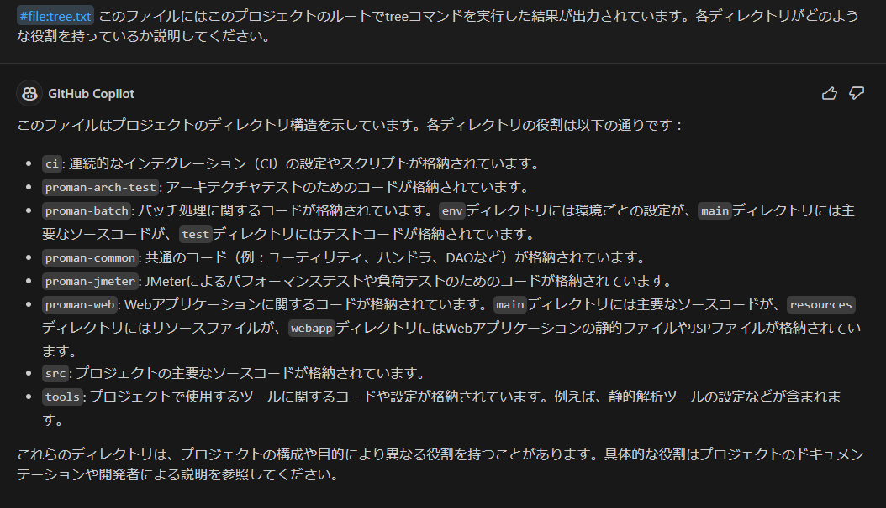
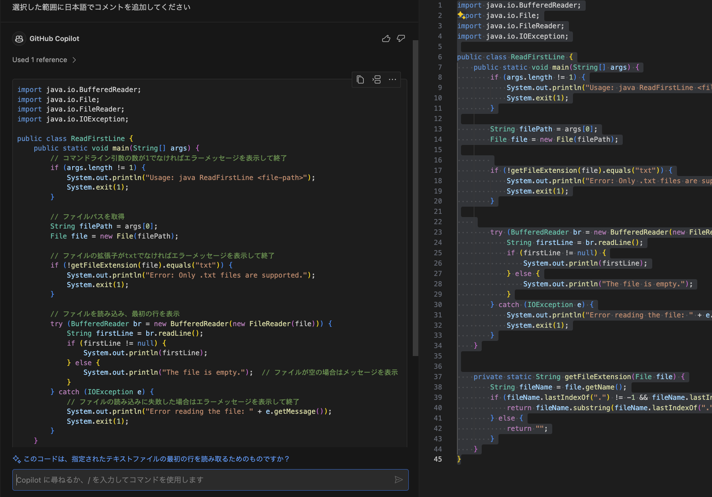
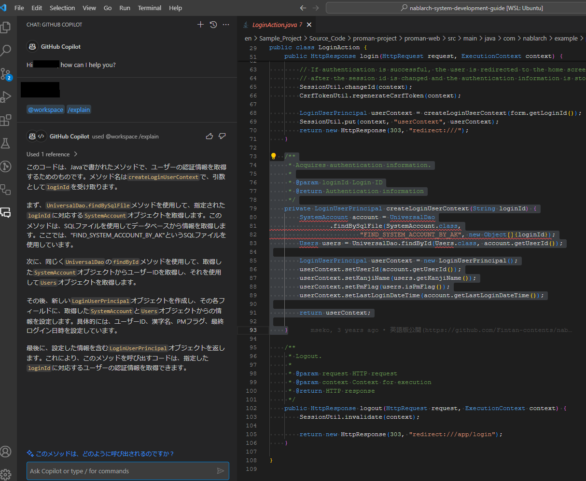
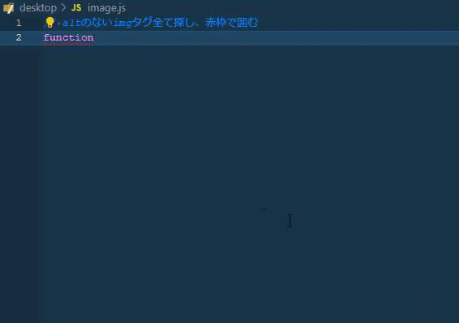
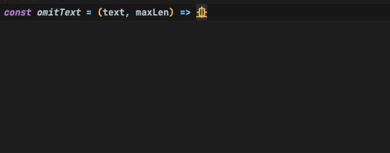

# その他手法

ここでは、コーディング時に使える手法を複数紹介します。
これらの手法によって、身近なところから開発効率を上げることができます。

## ディレクトリ構造を理解する

プロジェクトのディレクトリの中にどのようなファイルが入っているのかを一つ一つ確認しなくても、生成AIが大枠を説明してくれます。

手順

1. プロジェクトのルートディレクトリで、 `tree > tree.txt`  コマンドを実行する
    <details>
      <summary>tree.txt</summary>

    ```text
    フォルダー パスの一覧
    ボリューム シリアル番号は 1639-DC2E です
    C:.
    ├─ci
    ├─proman-arch-test
    │  └─src
    │      └─test
    │          └─java
    │              └─com
    │                  └─nablarch
    │                      └─example
    │                          └─proman
    │                              └─arch
    ├─proman-batch
    │  └─src
    │      ├─env
    │      │  ├─demo
    │      │  │  └─resources
    │      │  ├─dev
    │      │  │  └─resources
    │      │  └─prod
    │      │      └─resources
    │      ├─main
    │      │  ├─java
    │      │  │  └─com
    │      │  │      └─nablarch
    │      │  │          └─example
    │      │  │              └─proman
    │      │  │                  └─batch
    │      │  │                      └─project
    │      │  └─resources
    │      │      └─com
    │      │          └─nablarch
    │      │              └─example
    │      │                  └─proman
    │      │                      └─batch
    │      │                          └─project
    │      └─test
    │          ├─java
    │          │  └─com
    │          │      └─nablarch
    │          │          └─example
    │          │              └─proman
    │          │                  ├─batch
    │          │                  │  └─project
    │          │                  └─test
    │          └─resources
    ├─proman-common
    │  └─src
    │      ├─main
    │      │  ├─java
    │      │  │  └─com
    │      │  │      └─nablarch
    │      │  │          └─example
    │      │  │              └─proman
    │      │  │                  └─common
    │      │  │                      ├─code
    │      │  │                      ├─dao
    │      │  │                      ├─handler
    │      │  │                      ├─id
    │      │  │                      ├─util
    │      │  │                      └─validation
    │      │  └─resources
    │      │      ├─com
    │      │      │  └─nablarch
    │      │      │      └─example
    │      │      │          └─proman
    │      │      │              └─common
    │      │      ├─entity
    │      │      └─extraDdl
    │      └─test
    │          └─resources
    │              └─data
    ├─proman-jmeter
    │  ├─image
    │  ├─lib
    │  └─src
    │      ├─env
    │      │  └─ci
    │      │      └─resources
    │      └─test
    │          ├─java
    │          │  └─com
    │          │      └─nablarch
    │          │          └─example
    │          │              └─proman
    │          │                  ├─assertion
    │          │                  │  ├─db
    │          │                  │  └─response
    │          │                  ├─jmeter
    │          │                  ├─loader
    │          │                  └─scenario
    │          └─resources
    │              ├─WA10201
    │              │  └─001_register_project
    │              │      ├─db_dump
    │              │      ├─response
    │              │      └─scenario
    │              └─WA10203
    │                  └─001_modify_project
    │                      ├─db_dump
    │                      ├─response
    │                      └─scenario
    ├─proman-web
    │  ├─ci
    │  │  └─deploy-to-demo
    │  │      └─web
    │  └─src
    │      ├─env
    │      │  ├─demo
    │      │  │  └─resources
    │      │  ├─dev
    │      │  │  └─resources
    │      │  └─prod
    │      │      └─resources
    │      ├─main
    │      │  ├─java
    │      │  │  └─com
    │      │  │      └─nablarch
    │      │  │          └─example
    │      │  │              └─proman
    │      │  │                  └─web
    │      │  │                      ├─common
    │      │  │                      │  ├─authentication
    │      │  │                      │  │  ├─context
    │      │  │                      │  │  ├─encrypt
    │      │  │                      │  │  └─exception
    │      │  │                      │  ├─handler
    │      │  │                      │  │  └─threadcontext
    │      │  │                      │  └─validation
    │      │  │                      ├─login
    │      │  │                      └─project
    │      │  ├─resources
    │      │  │  ├─com
    │      │  │  │  └─nablarch
    │      │  │  │      └─example
    │      │  │  │          └─proman
    │      │  │  │              ├─entity
    │      │  │  │              └─web
    │      │  │  │                  ├─common
    │      │  │  │                  │  └─authentication
    │      │  │  │                  ├─project
    │      │  │  │                  ├─validation
    │      │  │  │                  └─webui
    │      │  │  └─net
    │      │  │      └─unit8
    │      │  │          └─http
    │      │  │              └─router
    │      │  └─webapp
    │      │      ├─javascripts
    │      │      ├─stylesheets
    │      │      └─WEB-INF
    │      │          ├─tags
    │      │          │  └─listSearchResult
    │      │          └─view
    │      │              ├─common
    │      │              ├─errorPages
    │      │              ├─login
    │      │              └─project
    │      └─test
    │          ├─java
    │          │  └─com
    │          │      └─nablarch
    │          │          └─example
    │          │              └─proman
    │          │                  └─web
    │          │                      ├─common
    │          │                      │  ├─dao
    │          │                      │  └─validation
    │          │                      └─project
    │          └─resources
    ├─src
    │  └─site
    └─tools
        ├─jspgenerator
        │  └─lib
        └─static-analysis
            ├─checkstyle
            ├─jspanalysis
            └─spotbugs
                └─published-config
                    └─production

    ```

    </details>
        
2. Copilot Chat Viewを開き、`@workspace #file:tree.txt このファイルにはこのプロジェクトのルートでtreeコマンドを実行した結果が出力されています。各ディレクトリがどのような役割を持っているか説明してください。` と送信する

実行例



応用:

- tree.txtのファイルサイズが大きすぎる場合は、適当なディレクトリ配下のみを出力するなどしてください

## コードにコメントを追加してもらう

方法

1. コメントしてもらいたいコードを範囲選択する
2. Copilot Chat Viewを開く
3. `選択した範囲に日本語でコメントを追加してください` と入力して送信する

実行例



## 既存コードについて解説してもらう

手順

1. コードを範囲選択し、Copilot Chat View を開く
2. `/explain` コマンドを叩く

実行例



## 自然言語で実装内容を伝え、コードを生成してもらう

コメント内で自然言語を使用して実行する操作を記述できます。目標を達成するためのコードの候補が示されます。

1. 新しい JavaScript ( *.js*) のファイルを作成します。
2. JavaScript ファイルで、次のコメントと関数の開始部分を入力します。 GitHub Copilot による関数の実装の候補が表示されます。
3. 提案を要求します。(Windowsの場合は`Alt + \`  。Macの場合は`Option + \` )
    
    候補表示時`Alt + ]`、`Alt +[` で他の補完候補を確認できます。(Macの場合は`Option + ]`、`Option + [` )

実行例

`// altのないimgタグ全て探し、赤枠で囲む
function// ← ここでスペースを挿入。候補が表示されます。`



[参考：GitHub Copilot を使用して IDE でコードの提案を取得する](https://docs.github.com/ja/copilot/getting-started-with-github-copilot#generating-code-suggestions-from-comments)

## コードの続きを補完してもらう

GitHub Copilotの最も利用頻度の高い使い方です。

今書いているコードにリアルタイムに次書くべきコードを提案をもらいます。

GitHub Copilotを有効化した状態でいつも通りコードを書くだけでも恩恵を受けることができます。

例として、関数の実装内容をGitHub Copilotに補完してもらう方法を記します。

1. まず関数、クラスの定義や処理を記述します。
2. その後下記のような動作を行うとGitHub Copilotが補完候補を提案してくれるので、補完候補を確認しTABキーでコードに反映させます。
- 候補を提案してほしい場所にカーソルを合わせます。
- 改行します。
- 提案を要求します。(Windowsの場合は`Alt + \`  、Macの場合は`Option + \` )

候補表示時`Alt + ]`、`Alt +[` で他の補完候補を確認できます。(Macの場合は`Option + ]`、`Option + [`  )



[参考：GitHub Copilot を使用して IDE でコードの提案を取得する](https://docs.github.com/ja/copilot/using-github-copilot/getting-code-suggestions-in-your-ide-with-github-copilot#seeing-your-first-suggestion)

## エラーログからバグの原因を特定する