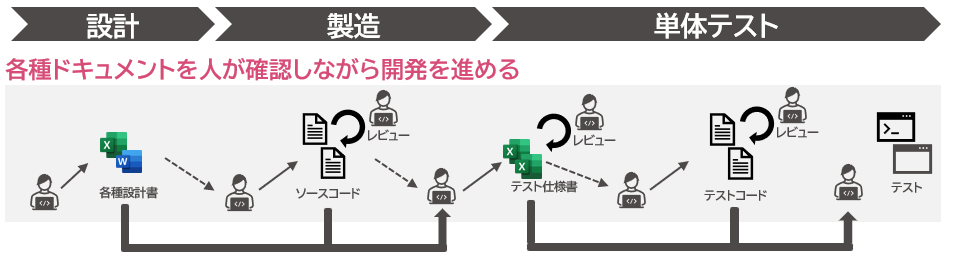
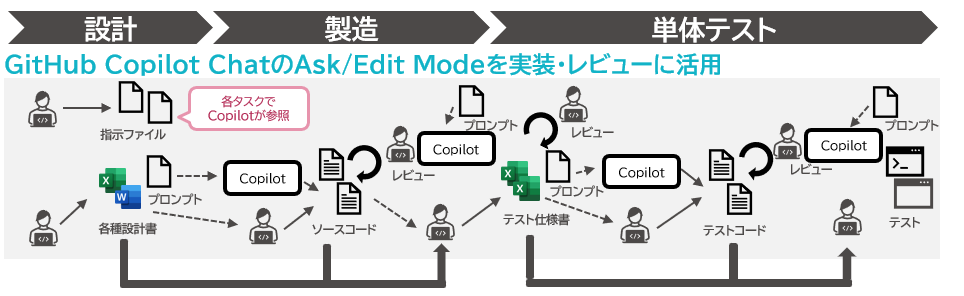
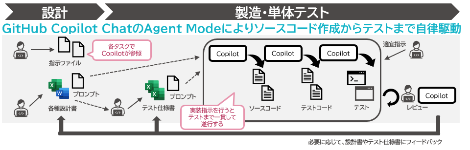

# 対象工程と開発プロセス

本ガイドではGitHub Copilotを主に製造および単体テスト工程で活用することを想定しています。  
ここでは、GitHub Copilotの適用工程と従来の開発プロセスからの変化、今後のAgent Modeが安定版となった際に想定される開発プロセスを記載しています。

## 従来の開発プロセス

生成AIが活用されるようになるまでは、以下の図のように各工程におけるソースコードおよびテストコード等の作成やレビューなど、すべての作業を人が実施していました。

## GitHub Copilot導入後

GitHub Copilot ChatのAsk ModeやEdit Modeおよび本ガイドを活用することで、製造や単体テスト工程で効率的なサポートが得られることを目指します。  
Ask ModeではGitHub Copilotに対して質問ができ、Edit Modeではソースコードの作成や修正といった作業を依頼できます。

AIから有用な回答を引き出したり、期待値に近いコード生成を行わせるには、プロジェクト側の準備とAIへの明確な指示がポイントになります。  

GitHub Copilot Chatを活用した開発プロセス導入後は、AIのサポートを得ながら開発を進めていきます。

## Agent Mode安定版導入後（予定）

<!-- textlint-disable ja-technical-writing/ja-no-mixed-period -->
<!-- textlint-disable jtf-style/4.3.2.大かっこ［］ -->
:::note[注意]
<!-- textlint-enable jtf-style/4.3.2.大かっこ［］ -->
<!-- textlint-enable ja-technical-writing/ja-no-mixed-period -->
本セクションの記載内容は、Agent Modeのプレビュー版時点での想定内容です。
:::

GitHub Copilot ChatのAsk ModeおよびEdit Modeでは作業主体はあくまで人のままであり、AIはサポートの位置づけです。

Agent Modeを利用すると、以下のようにGitHub Copilotに必要な情報を与えて指示した後はある程度自律的に動作することを期待して作業を任せられます。

たとえばAgent ModeのGitHub Copilot Chatに機能開発を依頼すると、ソースコードからテストコードの作成、テスト実行といった定めたプロセスで作業を実施させることができます。  
また開発ルールや静的解析などで修正内容に問題があることを検出できる仕組みを構築しておくと、GitHub Copilot自身に問題を認識させ、自己修復させることも可能です。

Agent Modeが利用可能になれば作業の主体はGitHub Copilotとなりますが、成果物の正しさ・妥当性は人が責任をもって確認・レビューする必要があります。  
もちろんGitHub Copilotにそのサポートは依頼できますが、最終的な責任を持つのは人になります。
