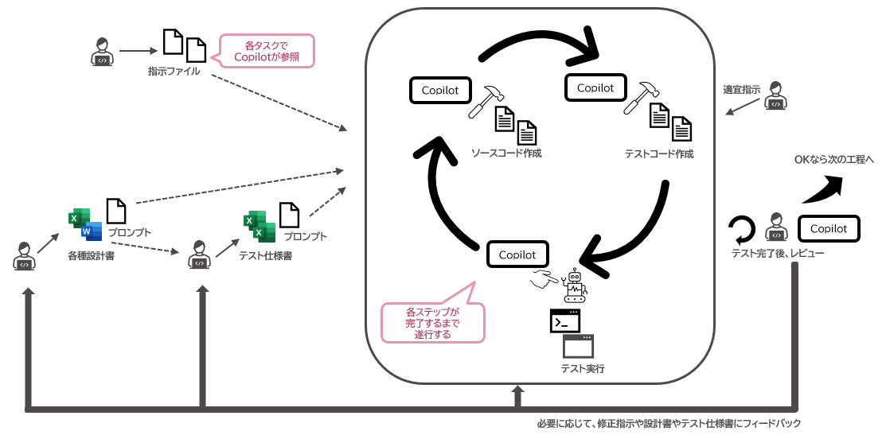

# プログラミング〜テスト

:::note
本ページは、GitHub Copilot ChatのAgent Mode向けのページです。
:::

ここでは、GitHub Copilot ChatのAgent Modeを使用してコーディングからテストコードの作成、テストの実行までの一連の流れを自律的に実施してもらう方法を記載します。

:::note
Agent Modeを活用することで、コーディングやテストの実施をある程度AIに自律的に任せることができますが、AIが生成した成果物の品質や妥当性を最終的に担保するのは人です。  
AIの生成結果を鵜呑みにせず、必ず人が確認するようにしてください。
:::

## 開発の流れ

このページでは、プログラミングからテストまでが以下の図のような開発の流れになることを想定しています。



Agent Modeを使う場合、[開発の進め方](../ai-on-boarding/files-to-be-maintained/how-to-proceed-with-development)で定めた手順に沿って開発を進めてもらいます。

この時、AIに作成してもらった成果物の妥当性をAI自身に検証してもらうため、ソースコードの作成だけではなくテストコードも合わせて作成してもらうことになるでしょう。  
そして作成されたソースコードやテストコードは、内容や網羅性に問題がないかどうかを人が確認します。

[AIと対話を始める](../begin-conversation-with-ai)や[指示のポイント](../ai-on-boarding/points-of-instructions)で記述したように、AIには実施して欲しい内容を具体的に指示し、タスクの遂行に必要な情報を与えることが重要です。

つまりGitHub Copilotに自律的に作業を実施させ、かつ精度を出すにはAIが理解しやすい形式で以下のドキュメントを用意してコンテキストとして与える必要があります。

- 設計書
- テスト仕様書

また、実際にソースコードを作成してみるとテストすべき内容の過不足に気づくことも多いでしょう。  
このような場合は、テスト仕様書へのテスト追加などを行いテストコードに反映します。

つまり、最初に作成してから確認、そして実装内容からのフィードバックを取り込んでいくような、イテレーションを行う開発プロセスになるでしょう。  
これを図示したものがこのセクションの最初の図になります。

## ソースコード作成からテスト実施までを行う

<!-- textlint-disable ja-technical-writing/ja-no-mixed-period -->
<!-- textlint-disable jtf-style/4.3.2.大かっこ［］ -->
:::info[使用するGitHub Copilot ChatのMode]
<!-- textlint-enable jtf-style/4.3.2.大かっこ［］ -->
<!-- textlint-enable ja-technical-writing/ja-no-mixed-period -->
Agent Modeを使います。
:::

GitHub Copilotに実装してもらいたい機能の設計書とテスト仕様書をMarkdown形式で用意しておき、機能の実装を指示します。  
テストコードは開発の進め方から判断してGitHub Copilotが自動で作成し、テストの実行まで行います。

以下のような[プロンプトファイル](../../ai-on-boarding/shared-instructions-prompts)を用意しておき、Chatウィンドウで呼び出します。

```markdown
---
mode: "agent"
tools: ["Agentが使用できるツール"]
description: "Serviceクラスを作成してください"
---

# 前提

このプロンプトファイルには入力変数が含まれます。
プロンプトファイルを呼び出しに、入力変数のいずれかが未指定の場合はプロンプトの実行を中止し、ユーザーに入力変数の指定を指示してください。

# 指示

設計書 ${input:doc} にもとづいて、Serviceクラスを実装してください。

- クラス名: ${input:className}
- メソッド名: ${input:methodName}

テストコードはテスト仕様書 ${input:spec} をもとに作成してください。  
またテストコードの内容を検討する際には、設計書 ${input:doc} とテスト対象クラス ${input:className} クラスも参考にしてください。
```

ここで、プロンプトファイルおよびプロンプトに指定すべき変数の値を以下と仮定します。

- プロンプトファイル： `.github/prompts/generate-service.prompt.md`
- 設計書（`${input:doc}`）： `#file:ユーザー登録機能.md`
- テスト仕様書（`${input:spec}`）： `#file:ユーザー登録機能テスト仕様書.md`
- 実装対象のクラス名（`${input:className}`）： `UserService`
- 実装対象のメソッド名（`${input:methodName}`）： `register`

<!-- textlint-disable ja-technical-writing/ja-no-mixed-period -->
<!-- textlint-disable jtf-style/4.3.2.大かっこ［］ -->
:::info[ポイント]
<!-- textlint-enable jtf-style/4.3.2.大かっこ［］ -->
<!-- textlint-enable ja-technical-writing/ja-no-mixed-period -->
プロンプトファイルの`tools`には、Agent Modeに利用させてもよいツールを指定します。

また`#file`は[Visual Studio Codeでファイルをコンテキストに追加する変数](https://code.visualstudio.com/docs/copilot/reference/copilot-vscode-features)です。
:::

この時、Chatウィンドウでは以下のように指示します。

```
/generate-service doc=#file:ユーザー登録機能.md spec=#file:ユーザー登録機能テスト仕様書.md  className=UserService methodName=register
```

この指示で、GitHub Copilotは[事前に整備したインストラクションファイル](../../ai-on-boarding/files-to-be-maintained)の内容を読み込んだうえで以下の作業を行います。

- `UserService`クラスの作成
- テストクラスの作成とテストメソッドの実装
- テストの実施

<!-- textlint-disable ja-technical-writing/ja-no-mixed-period -->
<!-- textlint-disable jtf-style/4.3.2.大かっこ［］ -->
:::info[ポイント]
<!-- textlint-enable jtf-style/4.3.2.大かっこ［］ -->
<!-- textlint-enable ja-technical-writing/ja-no-mixed-period -->
テスト実施などのためにGitHub Copilotが外部コマンドを実行する際には、都度ユーザに実行許可を求めます。  
これは意図しないコマンドの実行を防ぐための安全機能ですが、許可を与えない限りAIのタスクはそこで停止することに注意してください。
:::

ユーザに変更内容の承認を求めるのは、開発の進め方で定めた内容が完了した時になります。  
それまでは、外部コマンドの実行でユーザに実行許可を求める場合を除き、実装内容に問題があった場合は自己修復を試みます。

最終的に生成されたコードに問題がなければ承認し、そうでなければ拒否してGitHub Copilotに修正を依頼する、もしくは自分で修正してください。

### ポイント

Agent Modeを利用すると定めた開発の進め方に則りテストコードの作成まで行うため、1度に生成されるソースコードのボリュームが大きくなりがちです。
また単にソースコードを生成するのではなく、テスト実行など複数のステップを挟むため実行時間も伸びやすくなります。

一方で、AIが生成するコードは人がしなければいけません。  
生成されるソースコード量や実行時間も大きくなるため、インストラクションファイルが整備しきれていなかったり、曖昧な指示をしてしまったりすると、AIに大幅な修正依頼をすることが多くなるでしょう。  
結果として、かえって生産性が低下する要因となりかねません。

特に開発の初期段階では、扱いきれないほどの大量のソースコードを生成させるのではなく、人が確認できる量のソースコードを生成させて精度を見てみるとよいでしょう。

期待する精度のコードが生成されない場合は、インストラクションファイルやプロンプトファイルの指示内容、設計書の記述内容、コンテキストに与えるべき情報の不足といった点を確認し、必要に応じて修正します。

また、完璧なコードが生成されることを目指して永遠にプロンプトなどの改善とトライ＆エラーを繰り返すのではなく、ある程度のところで割り切って残りは人が修正するといった割り切りも必要でしょう。

AIにソースコードを出力させてもうまくいかない場合は、1度Ask Modeで実装予定の内容を出力させ、確認や調整を行ってからAgent Modeで出力させるという方法もあります。  
Modeの切り替えが手間にはなりますが、試してみてください。

## レビューを行う

GitHub Copilotにソースコードやテストコードのレビューをサポートしてもらい、レビュー効率を高める方法を記載します。

### ソースコードのレビュー

作成されたソースコードをレビューします。

#### 定型的な観点でのレビュー

<!-- textlint-disable ja-technical-writing/ja-no-mixed-period -->
<!-- textlint-disable jtf-style/4.3.2.大かっこ［］ -->
:::info[使用するGitHub Copilot ChatのMode]
<!-- textlint-enable jtf-style/4.3.2.大かっこ［］ -->
<!-- textlint-enable ja-technical-writing/ja-no-mixed-period -->
Ask Modeを使います。
:::

まず、プロジェクトで定められたコーディング規約や、一般的な品質（パフォーマンス、セキュリティなど）の観点でレビューを行います。
これらの定型的なチェックはAIに任せることで、人はより本質的な機能のレビューに集中できます。

[観点別にレビューを実施する](../../before-coding-test/review-perspective)で紹介したように、レビューしたいソースコードを開き、レビュー観点別に用意したプロンプトを[Promptis](https://marketplace.visualstudio.com/items?itemName=tis.promptis)で一括実行します。
たとえば、「セキュリティ」、「パフォーマンス」、「可読性」といった観点ごとにプロンプトを用意し、一括でレビューを実行することで、網羅的かつ効率的なレビューが可能になります。

#### 機能的な観点でのレビュー

<!-- textlint-disable ja-technical-writing/ja-no-mixed-period -->
<!-- textlint-disable jtf-style/4.3.2.大かっこ［］ -->
:::info[使用するGitHub Copilot ChatのMode]
<!-- textlint-enable jtf-style/4.3.2.大かっこ［］ -->
<!-- textlint-enable ja-technical-writing/ja-no-mixed-period -->
Ask Modeを使います。
:::

次に、ソースコードが設計書の仕様を正しく満たしているかを確認します。
AIにレビューさせることで、人による確認だけでは見落としがちな観点に気づける可能性があります。

以下のような[プロンプトファイル](../../ai-on-boarding/shared-instructions-prompts)を用意しておき、Chatウィンドウで呼び出します。

```markdown
---
mode: "ask"
description: "ソースコードが設計書に定義された仕様を満たしているかレビューしてください"
---

# 前提

このプロンプトファイルには入力変数が含まれます。
プロンプトファイルを呼び出しに、入力変数のいずれかが未指定の場合はプロンプトの実行を中止し、ユーザーに入力変数の指定を指示してください。

# 指示

設計書 ${input:doc} の内容を確認して、現在開いているソースコードが必要な処理を実装しているかレビューしてください。  
指摘は箇条書きで記載してください。
```

ここで、プロンプトファイルおよびプロンプトに指定すべき変数の値を以下と仮定します。

- プロンプトファイル： `.github/prompts/review-service.prompt.md`
- 設計書（`${input:doc}`）： `#file:ユーザー登録機能.md`

<!-- textlint-disable ja-technical-writing/ja-no-mixed-period -->
<!-- textlint-disable jtf-style/4.3.2.大かっこ［］ -->
:::info[ポイント]
<!-- textlint-enable jtf-style/4.3.2.大かっこ［］ -->
<!-- textlint-enable ja-technical-writing/ja-no-mixed-period -->
`#file`は[Visual Studio Codeでファイルをコンテキストに追加する変数](https://code.visualstudio.com/docs/copilot/reference/copilot-vscode-features)です。
:::

この時、Chatウィンドウでは以下のように指示します。

```
/review-service doc=#file:ユーザー登録機能.md
```

AIからのフィードバックを参考に、ソースコードを修正・改善します。

ただし、最終的な成果物責任は人にあることを忘れないようにしましょう。AIはあくまでサポート役です。

### テストコードのレビュー

ソースコードと同様に、テストコードもレビューします。

#### 定型的な観点でのレビュー

<!-- textlint-disable ja-technical-writing/ja-no-mixed-period -->
<!-- textlint-disable jtf-style/4.3.2.大かっこ［］ -->
:::info[使用するGitHub Copilot ChatのMode]
<!-- textlint-enable jtf-style/4.3.2.大かっこ［］ -->
<!-- textlint-enable ja-technical-writing/ja-no-mixed-period -->
Ask Modeを使います。
:::

プロジェクトで定められたテストコードの規約や、使用しているテストフレームワークの作法に沿っているかなどを確認します。
ソースコードの定型レビューと同様に、[Promptis](https://marketplace.visualstudio.com/items?itemName=tis.promptis)などを活用して効率的にレビューを行いましょう。
「テストの命名規則」や「アサーションの適切さ」といった観点でプロンプトを用意しておくと便利です。

#### 機能的な観点でのレビュー

<!-- textlint-disable ja-technical-writing/ja-no-mixed-period -->
<!-- textlint-disable jtf-style/4.3.2.大かっこ［］ -->
:::info[使用するGitHub Copilot ChatのMode]
<!-- textlint-enable jtf-style/4.3.2.大かっこ［］ -->
<!-- textlint-enable ja-technical-writing/ja-no-mixed-period -->
Ask Modeを使います。
:::

テストコードが、テスト仕様書で定義されたテストケースを網羅しているか、内容が妥当かを確認します。

以下のような[プロンプトファイル](../../../04_ai-on-boarding/02_shared-instructions-prompts/index.md)を用意しておき、Chatウィンドウで呼び出します。

```markdown
---
mode: "ask"
description: "テストコードがテスト仕様書に定義された仕様を満たしているかレビューしてください"
---

# 前提

このプロンプトファイルには入力変数が含まれます。
プロンプトファイルを呼び出しに、入力変数のいずれかが未指定の場合はプロンプトの実行を中止し、ユーザーに入力変数の指定を指示してください。

# 指示

テスト仕様書 ${input:spec} と設計書 ${input:doc} の内容を確認して、現在開いているテストコードが必要なテストを実装しているかレビューしてください。  
特に、テストケースの網羅性や、テストデータ、アサーションが適切かどうかの観点で確認してください。

指摘は箇条書きで記載してください。
```

ここで、プロンプトファイルおよびプロンプトに指定すべき変数の値を以下と仮定します。

- プロンプトファイル： `.github/prompts/review-test.prompt.md`
- テスト仕様書（`${input:spec}`）： `#file:ユーザー登録機能テスト仕様書.md`
- 設計書（`${input:doc}`）： `#file:ユーザー登録機能.md`

この時、Chatウィンドウでは以下のように指示します。

```
/review-test spec=#file:ユーザー登録機能テスト仕様書.md doc=#file:ユーザー登録機能.md
```

AIからのフィードバックを参考に、テストコードを修正・改善します。
これによりテストコードの品質を高め、テストの見落としを防ぐことができます。

ただし、ソースコードのレビューと同様に、最終的な成果物に対する責任は人にあることを忘れないようにしましょう。
