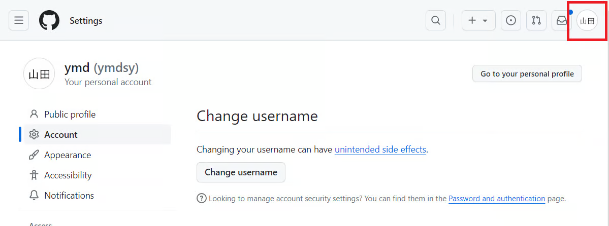
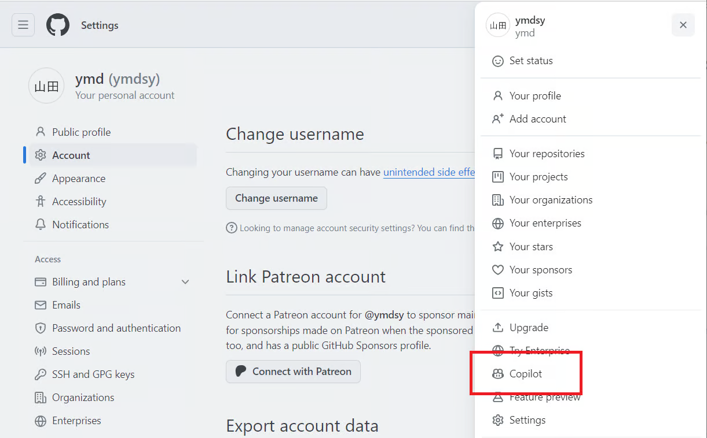
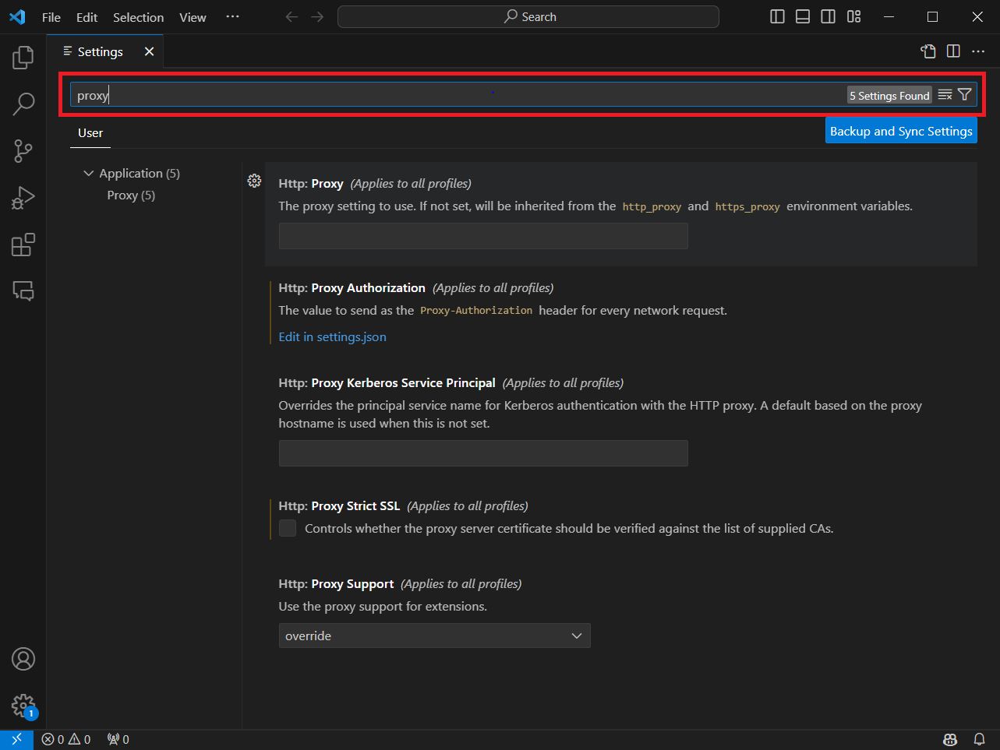
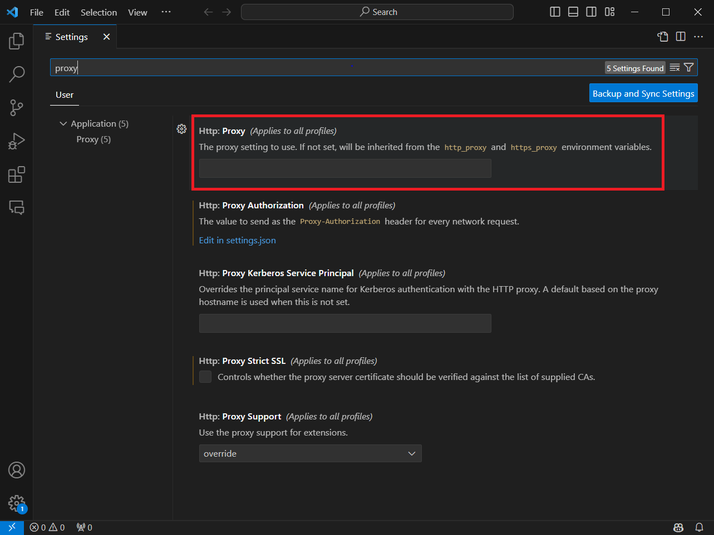
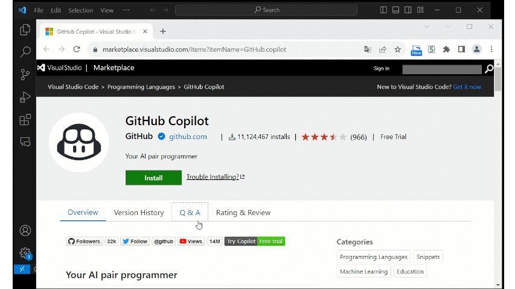
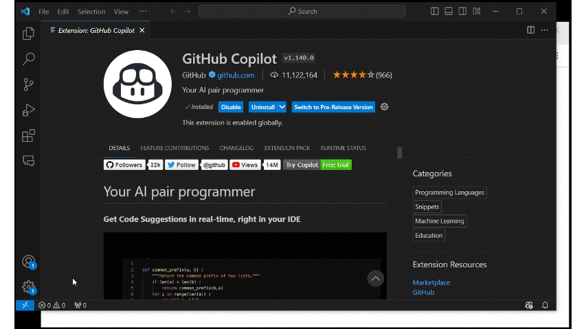
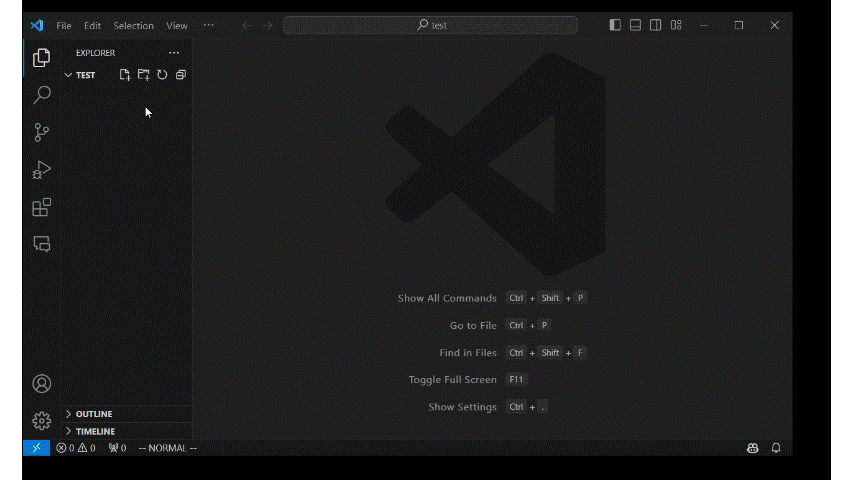
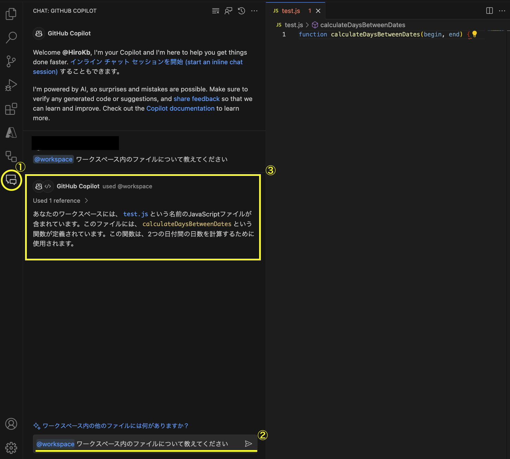

# インストール&設定

## 前提事項

GitHub Copilot導入者向けにて以下実施済みであることを前提とします。

- 参画PJでの利用可否を判断する
  - → 参画しているPJにてGitHub Copilotの利用可否をご判断ください
- 社内申請する
  - → 各社において必要な申請を行ってください

## GitHubアカウントの作成

GitHubアカウントをお持ちでない方は、[GitHubのトップページ](https://github.com/)を開き、右上にある「Sign up」からアカウントを作成してください。

- 会社のメールアドレスを使用してください
- 2要素認証の設定方法は以下のページを参照ください
  - [2 要素認証を設定する - GitHub Docs](https://docs.github.com/ja/authentication/securing-your-account-with-two-factor-authentication-2fa/configuring-two-factor-authentication)

## GitHub Copilotがアカウントに紐づいていることの確認

1. GitHubアカウントの [Copilotの設定ページ](https://github.com/settings/copilot)を開いてください。
    <details>
    <summary>画面右上のプロファイル画像をクリック ⇒ Copilotを選択することで開くこともできます</summary>

     - 画面右上のプロファイル画像（赤枠箇所）をクリック
          
     - Copilotを選択（赤枠箇所）
          

      </details>
2. organizationに参加してCopilotを利用している場合、以下の`赤枠`が表示されていればOKです
    

## Visual Studio Codeの設定方法

### インストール

1. [Visual Studio Code](https://code.visualstudio.com/Download)をインストールします。
2. 必要な方は、プロキシ設定をします

    <details>
    <summary>Visual Studio Code のプロキシ設定方法</summary>

    1. Visual Studio Codeを起動してください
    2. `Ctrl`+ `,`もしくは `File`⇒ `Preferences` ⇒ `Settings`から設定を開いてください
        
    3. 設定画面の `Search settings`欄に `proxy`と入力してください
        
    4. `Http: Proxy`の項目にプロキシの情報を入力してください
        

    </details>

### 拡張機能GitHub Copilotのインストール

- [Extensions for Visual Studio Code](https://marketplace.visualstudio.com/)で[GitHub Copilot](https://marketplace.visualstudio.com/items?itemName=GitHub.copilot)を開きInstallボタンを押下してください
- Visual Studio Codeが開き、拡張機能の画面が開きます
- Visual Studio Code上でInstallボタンを押下してください
    
- Visual Studio Code上でGitHubアカウントにログインします
  - Visual Studio Code左下のユーザアイコン ⇒「Sign in with GitHub to use GitHub Copilot」を押下してください
  - ブラウザが起動するので、認証を許可してください
    
- GitHub Copilotが利用できることを確認します
  - 新規JavaScriptファイルを作成してください。以下のコードを貼り付け、**エンターキーを押して**ください。候補が表示されれば確認完了です

    ```markdown
    function calculateDaysBetweenDates(begin, end) {
    ```

    

    :::info
    💡 うまく候補が表示されない場合は、以下を試してください。
    - Visual Studio Codeを再起動する
    - GitHubにログインできているか確認する
    - [GitHub Copilotがアカウントに紐づいていることの確認](#github-copilotがアカウントに紐づいていることの確認)を行う
    :::

### 拡張機能GitHub Copilot Chatのインストール

- [GitHub Copilot Chat](https://marketplace.visualstudio.com/items?itemName=GitHub.copilot-chat) をインストールする
- GitHub Copilot Chatが利用できることを確認します
  - ①のメニューを押下しCopilot Chatパネルを開きます
  - ②の入力欄に`@workspace ワークスペース内のファイルについて教えてください`と入力・送信します
  - ③のエリアにCopilotからの回答が表示されれば確認完了です
    
- Chatの応答を日本語化
  - GitHub Copilot Chatは、デフォルトでは[display language](https://code.visualstudio.com/docs/getstarted/locales)で設定された言語を用いて初期応答を行います
  - `github.copilot.chat.localeOverride`を設定することでこの動作を上書きすることができます
  - `Ctrl + Shift + P`キーを押してコマンドパレットを表示し、`settings`と入力して、設定を表示して開きます
    
  - 検索欄へ`github.copilot.chat.localeOverride`と入力して、表示された項目を`ja`に設定します
      
    ※ この設定を行うにはVS Codeのバージョンが1.8.4以降である必要があります  
    参考：[VSCode更新情報 2023年10月](https://code.visualstudio.com/updates/v1_84#_chat-using-configured-display-language)

## 参考

[GitHub Copilotを使用してIDEでコードの提案を取得する - GitHub Docs](https://docs.github.com/ja/enterprise-cloud@latest/copilot/using-github-copilot/getting-code-suggestions-in-your-ide-with-github-copilot?tool=vscode#visual-studio-code-%E3%81%A7-github-copilot-%E6%8B%A1%E5%BC%B5%E6%A9%9F%E8%83%BD%E3%82%92%E3%82%A4%E3%83%B3%E3%82%B9%E3%83%88%E3%83%BC%E3%83%AB%E3%81%99%E3%82%8B)
