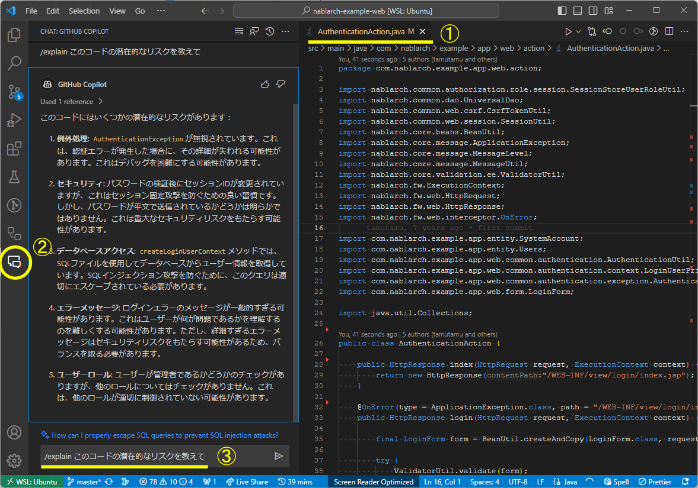
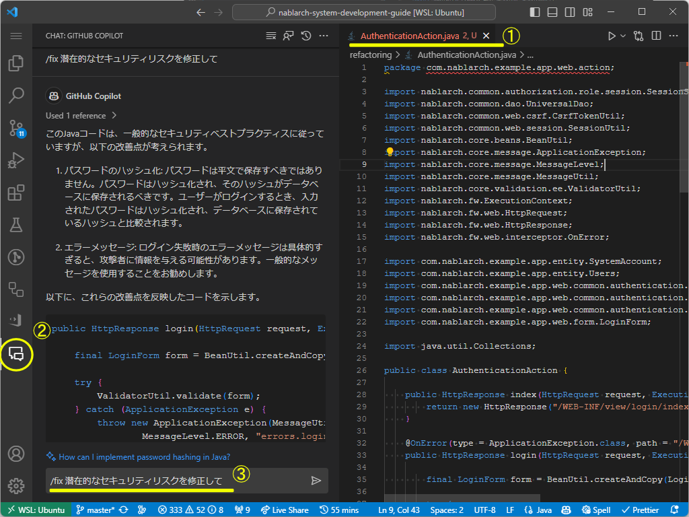

TODO「開発ガイド ＞ 8.1. コードを生成する」盛り込み


## コードから補完する

GitHub Copilotの最も利用頻度の高い使い方です。<br/>
今書いているコードに対してリアルタイムに次書くべきコードを提案をもらいます。<br/>
GitHub Copilotを有効化した状態でいつも通りコードを書くだけでも恩恵を受けることができます。<br/>

例として、関数の実装内容をGitHub Copilotに補完してもらう方法を記します。

1. まず関数、クラスの定義や処理を記述します。
2. その後下記のような動作を行うとGitHub Copilotが補完候補を提案してくれるので、補完候補を確認しTABキーでコードに反映させます。
- 候補を提案してほしい場所にカーソルを合わせます
- 改行します
- 提案を要求します（Windowsの場合は`Alt + \`、Macの場合は`Option + \`）

候補表示時`Alt + ]`、`Alt +[` で他の補完候補を確認できます。(Macの場合は`Option + ]`、`Option + [`)

<br/>
[GitHub Copilot の概要 - GitHub Docs](https://docs.github.com/ja/copilot/using-github-copilot/getting-started-with-github-copilot#seeing-your-first-suggestion)

## コメントから補完する

:::note
- 以下をマージ
  - コードを書く ＞ 自然言語で実装内容を伝え、コードを生成してもらう
  - 開発ガイド ＞ 8.1. コードを生成する ＞ 8.1.1. コメントよりコードを補完する
:::

コメント内で自然言語を使用して実行する操作を記述できます。目標を達成するためのコードの候補が示されます。

1. 新しいJavaScript(*.js*) のファイルを作します
2. JavaScriptファイルで、次のコメントと関数の開始部分を入力します。GitHubCopilotによる関数の実装の候補が表示されます
3. 提案を要求します（Windowsの場合は`Alt + \`。Macの場合は`Option + \`）  
候補表示時`Alt + ]`、`Alt +[` で他の補完候補を確認できます。(Macの場合は`Option + ]`、`Option + [` )

```jsx
// altのないimgタグ全て探し、赤枠で囲む
function// ← ここでスペースを挿入。候補が表示されます。
```

<br/>
[https://docs.github.com/ja/copilot/getting-started-with-github-copilot#generating-code-suggestions-from-comments](https://docs.github.com/ja/copilot/getting-started-with-github-copilot#generating-code-suggestions-from-comments)

## セキュリティリスクを検知してもらう

セキュリティリスクの可能性があるか意見をもらう。

- セキュリティリスクを発見したいファイル

    nablarchのサンプルコードに今回のチェック用に修正を加えたものです。

    ```java
    package com.nablarch.example.app.web.action;
    
    import nablarch.common.authorization.role.session.SessionStoreUserRoleUtil;
    import nablarch.common.dao.UniversalDao;
    import nablarch.common.web.csrf.CsrfTokenUtil;
    import nablarch.common.web.session.SessionUtil;
    import nablarch.core.beans.BeanUtil;
    import nablarch.core.message.ApplicationException;
    import nablarch.core.message.MessageLevel;
    import nablarch.core.message.MessageUtil;
    import nablarch.core.validation.ee.ValidatorUtil;
    import nablarch.fw.ExecutionContext;
    import nablarch.fw.web.HttpRequest;
    import nablarch.fw.web.HttpResponse;
    import nablarch.fw.web.interceptor.OnError;
    
    import com.nablarch.example.app.entity.SystemAccount;
    import com.nablarch.example.app.entity.Users;
    import com.nablarch.example.app.web.common.authentication.AuthenticationUtil;
    import com.nablarch.example.app.web.common.authentication.context.LoginUserPrincipal;
    import com.nablarch.example.app.web.common.authentication.exception.AuthenticationException;
    import com.nablarch.example.app.web.form.LoginForm;
    
    import java.util.Collections;
    
    public class AuthenticationAction {
    
        public HttpResponse index(HttpRequest request, ExecutionContext context) {
            return new HttpResponse("/WEB-INF/view/login/index.jsp");
        }
    
        @OnError(type = ApplicationException.class, path = "/WEB-INF/view/login/index.jsp",statusCode = 403)
        public HttpResponse login(HttpRequest request, ExecutionContext context) {
    
            final LoginForm form = BeanUtil.createAndCopy(LoginForm.class, request.getParamMap());
    
            try {
                ValidatorUtil.validate(form);
            } catch (ApplicationException e) {
                throw new ApplicationException(MessageUtil.createMessage(
                        MessageLevel.ERROR, "errors.login" + e.getMessage()));
            }
    
            try {
                AuthenticationUtil.authenticate(form.getLoginId(), form.getUserPassword());
            } catch (AuthenticationException ignore) {
                throw new ApplicationException(MessageUtil.createMessage(
                        MessageLevel.ERROR, "errors.login"));
            }
    
            SessionUtil.changeId(context);
            CsrfTokenUtil.regenerateCsrfToken(context);
    
            LoginUserPrincipal userContext = createLoginUserContext(form.getLoginId());
    
            if (userContext.isAdmin()) {
                SessionStoreUserRoleUtil.save(Collections.singleton(LoginUserPrincipal.ROLE_ADMIN), context);
            }
    
            SessionUtil.put(context, "userContext", userContext);
            SessionUtil.put(context,"user.id",String.valueOf(userContext.getUserId()));
            return new HttpResponse(303, "redirect:///action/project/index");
        }
    
        private LoginUserPrincipal createLoginUserContext(String loginId) {
            SystemAccount account = UniversalDao
                    .findBySqlFile(SystemAccount.class,
                            "FIND_SYSTEM_ACCOUNT_BY_AK", new Object[]{loginId});
            Users users = UniversalDao.findById(Users.class, account.getUserId());
    
            LoginUserPrincipal userContext = new LoginUserPrincipal();
            userContext.setUserId(account.getUserId());
            userContext.setKanjiName(users.getKanjiName());
            userContext.setAdmin(account.isAdminFlag());
            userContext.setLastLoginDateTime(account.getLastLoginDateTime());
    
            return userContext;
    
        }
    
        public HttpResponse logout(HttpRequest request, ExecutionContext context) {
            SessionUtil.invalidate(context);
    
            return new HttpResponse(303, "redirect:///action/login");
        }
    
    }
    ```

1. エディタで、該当のファイルを開きます。
2. Copilot Chat Viewを開きます。
3. `/explain このコードの潜在的なリスクを教えて`と入力し送信します。
4. GitHub Copilot Chatにより、セキュリティリスクになりそうな箇所が提示されます。



## エラーや問題点のある箇所の修正提案をもらう

GitHub Copilot Chatで`/fix`を使うことで、修正提案をもらうことができます。

1. エディタで、該当のファイルを開きます。
2. Copilot Chat Viewを開きます。
3. `/fix このコードの潜在的なリスクを教えて`と入力し送信します。
4. GitHub Copilot Chatにより、セキュリティリスクになりそうな箇所と修正案が提示されます。



## エディタ上で提案をもらう

GitHub Copilot Chatは、Copilot Chat Viewを開かなくても利用が可能です。

1. エディタ上で右クリック
2. Copilotにカーソルをあわせる
3. `Start in Editor` をクリック

詳細はこちらをご確認ください [インラインチャット](../08_vscode-extention/01_github-copilot/03_inline-chat.md)


