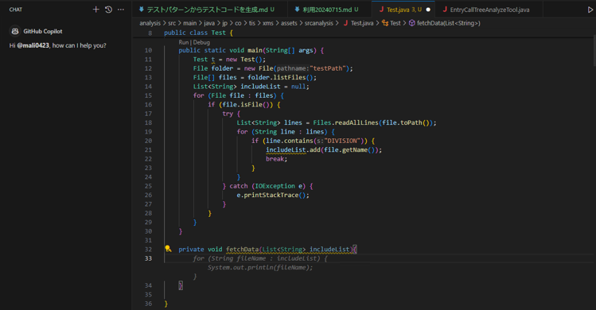
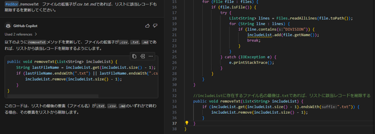
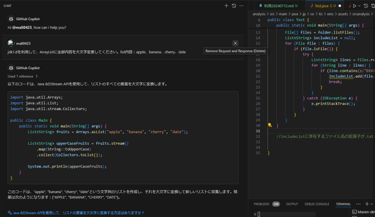
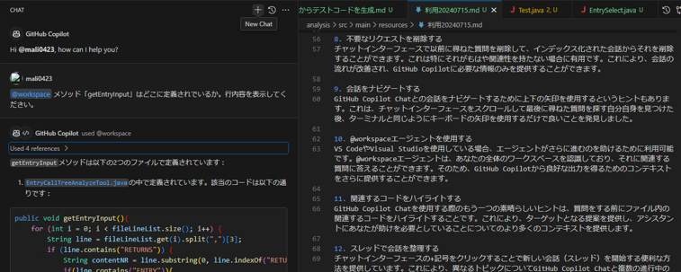

# 適切なコンテキストを与える

:::info
本ページは以下からの抜粋です。詳細は以下を御覧ください。 
[GitHub Copilot の使用についてのベストプラクティス - GitHub Docs](https://docs.github.com/ja/copilot/using-github-copilot/best-practices-for-using-github-copilot#copilot-%E3%82%92%E5%BD%B9%E7%AB%8B%E3%81%A4%E5%87%BA%E5%8A%9B%E3%81%AB%E5%B0%8E%E3%81%8F) 
[GitHub Copilot のプロンプト エンジニアリング - GitHub Docs](https://docs.github.com/ja/copilot/using-github-copilot/prompt-engineering-for-github-copilot)
:::

## 変数名などに意味のある名前を付ける

`foo`や`bar`という名前の関数がある場合、GitHub Copilotは名前から意図を推測できないため、最適な補完ができません。  
同様に、関数名`fetchData()`は`Data`という語が曖昧であるため、GitHub Copilotにとってもあまり意味がありません。

一般的に「良い」と言われるコーディングルールを適用することで、GitHub Copilotから最大の価値を取得できます。

- 関数名`fetchData`（意味のない名前）
  - エディタで、該当ファイルを開く
  - メソッド名がfetchDataを指定する
  - メソッド中に`Alt＋\`を実行し、提案を要求し、GitHub Copilotへ下記コードを自動補完する
    
- 関数名fetchDataEndwithtxt（意味のある名前）
  - エディタで、該当ファイルを開く
  - メソッド名がfetchDataEndwithtxtを指定する
  - メソッド中に`Alt＋\`を実行し、提案を要求し、GitHub Copilotへ下記コードを自動補完する
    

## 効果的なコンテキストの指定

- VS CodeでGitHub Copilotを使用している場合は、関連するファイルを開き、無関係なファイルを閉じます（※1）
- GitHub Copilot Chatでは、特定の要求が有用なコンテキストでなくなった場合は、その要求を会話から削除します
- GitHub Copilot Chatでは、特定の会話のどのコンテキストも役に立たない場合は、新しい会話を開始します
- VS CodeでGitHub Copilot Chatを使用している場合は、キーワードを使用して、GitHub Copilotを特定のタスクまたはコンテキストにフォーカスします

:::info

### ※1 コンテキストの提供

- IDEでファイルを開いておくことで、GitHub Copilotにコンテキストを提供します。
- GitHub Copilot Chatにて`#editor`を使用して追加のコンテキストを提供できます
  - VS Codeで、該当ファイルを開く
    
  - GitHub Copilotに以下を入力する
    - `#editor /removeTxt　ファイルの拡張子が.csv .txt .mdであれば、リストに該当レコードも削除するを更新してください。`
  - 更新後コードが提案される
- コンテキストスイッチングを行ったり、次のタスクに移るときには、不要なファイルを閉じることを忘れないでください
:::

## プロンプトの言い換え・分割

GitHub Copilotから有用な回答を得られない場合は、要求を別の言葉で言い換えるか、要求を複数の小さな要求に分割してみます。 
たとえば、GitHub Copilotに単語検索パズルを生成するように依頼する代わりに、プロセスを小さなタスクに分割し、GitHub Copilotに1つずつ実行するように依頼します。

- 10x10の文字グリッドを生成する関数を記述します
- 有効な単語の一覧を指定して、文字グリッド内のすべての単語を検索する関数を記述します
- 前の関数を使用して、少なくとも10個の単語を含む10x10個の文字グリッドを生成する関数を記述します
- 前の関数を更新して、グリッドから文字のグリッドと10個のランダムな単語を出力します

## コミュニケーションの削除

チャットインターフェースで以前に尋ねた質問を削除して、インデックス化された会話からそれを削除することができます。 
これは特にそれがもはや関連性を持たない場合、会話の流れが改善され、GitHub Copilotに必要な情報のみを提供することができます。

### 不要なリクエストの削除

- GitHub Copilot Chat Viewを開く
- アイコン`x`をクリックする
  - 削除前：
    
  - 削除後：
    

### コミュニケーションをクリア

- GitHub Copilot Chat Viewを開く
- GitHub Copilotに以下を入力する
    
- 現在のコミュニケーションをクリアする
  - 削除前：
    
  - 削除後：
    

## スレッドで会話を整理

GitHub Copilot Chatの`＋`をクリックすることで新しい会話（スレッド）を開始できます。 
これにより、GitHub Copilot Chatと複数の異なるトピックを同時進行できます。

- GitHub Copilot Chat Viewを開く
- アイコン`＋`をクリックする
  - 実行前：
    
  - 実行後：
    

## 提案の選択

コード補完時にGitHub Copilotは複数の提案を提示する可能性があります。 
キーボードショートカット（`Ctrl+Enter`）を使用すると、使用可能なすべての提案をすばやく確認できます。

## フィードバック

今後の提案を改善するためのフィードバックを提供します。 
次のようなさまざまな方法でフィードバックを提供できます。コード補完の場合は、GitHub Copilotの提案を受け入れるか拒否します。 
GitHub Copilot Chatの個々の応答の場合は、応答の横にあるサムアップアイコンまたはサムダウンアイコンをクリックします。
